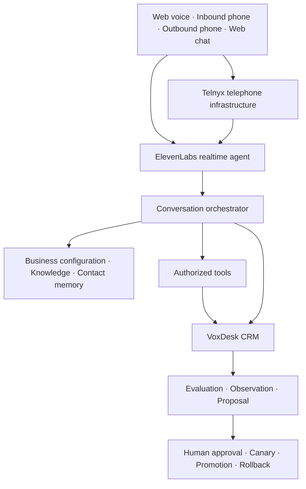

# VoxDesk

Voice Operations Platform

VoxDesk handles conversations coming into a business and approved conversations going out across telephone, website voice, and web chat. It converts each interaction into structured CRM context, authorized actions, appointments, opportunities, tasks, follow-ups, handoffs, analytics, and supervised quality observations.

The repository is under active production hardening. A passing build is not evidence that a provider or deployment is production-ready; see [Known limitations](#known-limitations).

## Problem

Business conversations often fail after the customer speaks: calls are missed, details are copied manually, appointments are not reconciled, follow-ups are forgotten, and human handoffs lack context. VoxDesk provides one operational record and policy boundary for the conversation and every resulting action.

## Solution

- One canonical Conversation model for phone, website voice, and text
- Telnyx as telephone infrastructure
- ElevenLabs Agents as the canonical realtime conversational layer
- Server-owned, tenant-authorized CRM and calendar tools
- Controlled outbound workflows with consent, suppression, calling-window, attempt, approval, and capacity checks
- A unified internal CRM and contact timeline
- Human-supervised evaluation, canary, promotion, and rollback

## Product demo

The public demo uses an isolated fictional workspace and deterministic adapters where a live integration is unavailable. Demo records and provider readiness are explicitly labelled. It cannot dial arbitrary telephone numbers or mutate customer integrations.

Production URL: [voxdesk-ai.vercel.app](https://voxdesk-ai.vercel.app)

## Channels

| Channel        | Canonical record                      | Realtime layer                | Status rule                                                    |
| -------------- | ------------------------------------- | ----------------------------- | -------------------------------------------------------------- |
| Website voice  | Conversation                          | ElevenLabs WebRTC             | Requires a configured, verified language and agent             |
| Inbound phone  | Conversation + Call                   | Telnyx SIP to ElevenLabs      | Requires number, routing, SIP, agent, and webhook verification |
| Outbound phone | Conversation + Call + OutboundAttempt | ElevenLabs SIP through Telnyx | Requires approved workflow and all compliance gates            |
| Web chat       | Conversation                          | VoxDesk orchestrator          | Uses the same knowledge, tools, CRM, and evaluation boundaries |

## Architecture



Detailed architecture:

- [Platform overview](docs/architecture/overview.md)
- [Conversation model](docs/architecture/conversation-model.md)
- [Orchestration](docs/architecture/orchestration.md)
- [Telephony](docs/architecture/telephony.md)
- [Call state machine](docs/architecture/call-state-machine.md)
- [Multitenancy](docs/architecture/multitenancy.md)
- [Improvement loop](docs/architecture/improvement-loop.md)

## Conversation orchestration

The orchestrator determines intent, requested outcome, workflow risk, language, specialist, and escalation. Specialists share persisted ConversationState; a transfer does not restart intake. The model may request a tool, but only the server can authorize and execute it.

## CRM

VoxDesk remains the operational source of truth for:

- Contacts and communication preferences
- Conversations, messages, fields, summaries, and completeness
- Calls and immutable provider events
- Appointments and opportunities
- Tasks, follow-ups, handoffs, campaigns, and outbound attempts
- Compliance evidence and quality observations

External CRM adapters synchronize outward without owning live conversation state.

## Inbound calling

A verified Telnyx event resolves an exact provider number or normalized HMAC lookup to PhoneNumber, Business, Workspace, published AgentVersion, immutable BusinessTrainingPack, and verified LanguageProfile. Webhook ingestion verifies signatures, persists an idempotent provider event, acknowledges promptly, and processes projections asynchronously.

Setup: [Inbound calls](docs/guides/inbound-calls.md) and [Telnyx](docs/guides/telnyx-setup.md).

## Outbound calling

Supported workflows are explicitly bounded: requested callbacks, appointment reminders, customer follow-up, missing-information reminders, service updates, consented lead follow-up, and surveys.

Every attempt is revalidated immediately before execution. The canonical worker creates the Call and Conversation, acquires distributed leases, invokes the ElevenLabs SIP-trunk outbound endpoint, persists provider correlation IDs, reconciles Telnyx and ElevenLabs terminal events, and releases capacity. Ambiguous provider failures fail closed to prevent duplicate calls.

Setup: [Outbound calls](docs/guides/outbound-calls.md).

## Multilingual system

Languages are enabled through LanguageProfile capability records. A language is not “supported” merely because a provider lists it; it must have verified provider behavior, complete business and disclosure content, tools, date/number behavior, pronunciation, and evaluation evidence.

Guide: [Language onboarding](docs/guides/language-onboarding.md).

## Human handoff

Warm transfer, cold transfer, callback, task, and queue outcomes are represented as explicit Handoff state. VoxDesk does not claim that a human is connected until the provider confirms it. Failed transfers can offer a callback, which is persisted only after authorization and customer agreement.

## Campaign controls

Campaigns progress through draft, approval, scheduling, and running states. Dry-run reports identify invalid, suppressed, unconsented, unsupported, outside-window, or otherwise ineligible recipients. Browser requests never provide authoritative destination numbers or caller IDs.

Operations guide: [Campaign controls](docs/operations/campaign-controls.md).

## Security and privacy

Core controls include:

- Session to membership to role to workspace authorization
- Tenant-scoped resource queries with non-disclosing not-found behavior
- Raw-body webhook verification, timestamp bounds, replay protection, and event idempotency
- Signed, short-lived ConversationContext for tools
- HMAC lookup identifiers and encrypted sensitive values
- Recording disabled until policy and consent permit it
- Rate and cost controls for voice, tools, campaigns, login, and demo traffic
- SSRF restrictions for configurable outbound webhooks
- Metadata-only routine logging

Security documentation:

- [Threat model](docs/security/threat-model.md)
- [Tenant isolation](docs/security/tenant-isolation.md)
- [Webhook security](docs/security/webhooks.md)
- [Tool authorization](docs/security/tool-authorization.md)
- [Outbound compliance](docs/security/outbound-compliance.md)
- [Recording](docs/security/recording.md)
- [Data retention](docs/security/data-retention.md)

No security document or test result is a claim of zero vulnerabilities.

## Supervised improvement

Quality analysis produces observations, not production mutations. A reviewer-approved proposal creates an immutable candidate agent version. Promotion requires complete golden-suite coverage, zero critical regression failures, a bounded canary with sufficient evidence, and an authorized atomic promotion. Rollback restores a known previous deployment and records the reason and actor.

## Technology

- Next.js App Router and strict TypeScript
- PostgreSQL and Prisma
- Redis-compatible distributed leases and quotas
- ElevenLabs Agents and SIP trunk outbound API
- Telnyx Voice API, SIP, and signed webhooks
- Zod boundary validation
- Vitest and Playwright
- Vercel deployment target

## Repository structure

```text
app/          Routes, server-rendered product surfaces, and API boundaries
components/   Shared product and demo UI
lib/          Domain, provider, security, CRM, orchestration, and policy services
prisma/       Additive schema migrations and Prisma models
workers/      Durable provider-event and outbound job processors
tests/        Unit, integration, security, and browser acceptance tests
scripts/      Explicit provisioning and authorized live-test utilities
docs/         Durable architecture, security, guide, and operations documentation
```

## Local setup

Requirements:

- Node.js 20
- PostgreSQL
- Redis-compatible service for distributed production controls

```bash
npm ci
cp .env.example .env.local
npx prisma migrate dev
npm run dev
```

Do not use development secrets or demo authentication in production.

## Environment

Production fails closed when required security secrets are absent. Important groups include:

- Application: `APP_URL`, `DATABASE_URL`, `DIRECT_URL`
- Security: `AUTH_SECRET`, `ENCRYPTION_KEY`, `INTERNAL_API_SECRET`, `IP_HASH_SECRET`, `PHONE_HASH_SECRET`
- Demo isolation: `DEMO_SESSION_SECRET` and explicit demo limits
- ElevenLabs: API key, webhook secret, agent and imported SIP phone mappings
- Telnyx: API key, public key, connection, outbound profile, SIP, and webhook configuration
- Redis: REST URL and token
- Feature flags default to disabled

Never commit provider credentials.

## Database

Review every migration before applying it. Conversation and provider architecture changes are additive: introduce, backfill, migrate reads/writes, verify, and only then retire legacy storage. Take a production backup before any destructive migration.

```bash
npx prisma validate
npx prisma migrate deploy
```

## Redis

Production concurrency uses atomic, expiring leases across platform, provider, workspace, business, agent, phone-number, and campaign scopes. Inbound capacity has priority. Redis unavailability must not silently turn into unlimited outbound execution.

## Provider setup

- [ElevenLabs SIP](docs/guides/elevenlabs-sip.md)
- [Telnyx setup](docs/guides/telnyx-setup.md)
- [Provider readiness](docs/operations/provider-readiness.md)

“Configured” and “verified” are distinct states.

## Testing

```bash
npm run format:check
npm run lint
npm run typecheck
npm run test:unit
npm run test:integration
npm run test:security
npx prisma validate
npm run audit:routes
npm run build
npm run test:e2e
```

Live provider tests are separate from CI and may run only with owned, authorized, consented test numbers. They must verify the same persisted Conversation across provider, tools, CRM, finalization, and evaluation.

## Deployment

Use a feature branch, preview deployment, migration review, browser QA, merge, production deployment, exact-SHA verification, and production smoke test. A READY preview or successful build is not production acceptance.

Operations:

- [Incident response](docs/operations/incident-response.md)
- [Rollback](docs/operations/rollback.md)
- [Provider readiness](docs/operations/provider-readiness.md)

## Known limitations

- Live web voice, inbound, outbound, concurrent calling, and human-transfer acceptance depend on external provider configuration and authorized test numbers; repository CI does not prove them.
- Provider concurrency depends on the subscribed Telnyx and ElevenLabs limits.
- Only languages with verified LanguageProfile evidence should be enabled.
- Legacy demo adapters remain isolated for fictional walkthroughs and are not production integrations.
- Production migration, preview, exact-SHA deployment, browser screenshots, and provider smoke evidence must be recorded for the target environment.

## Roadmap

- Complete authorized provider acceptance across web voice, inbound, outbound, concurrency, and human handoff
- Expand golden suites by business, language, channel, and workflow
- Add verified external CRM and calendar adapters as customer configuration requires
- Continue removing legacy call-centric and demo-only paths after migration evidence

## License

MIT
