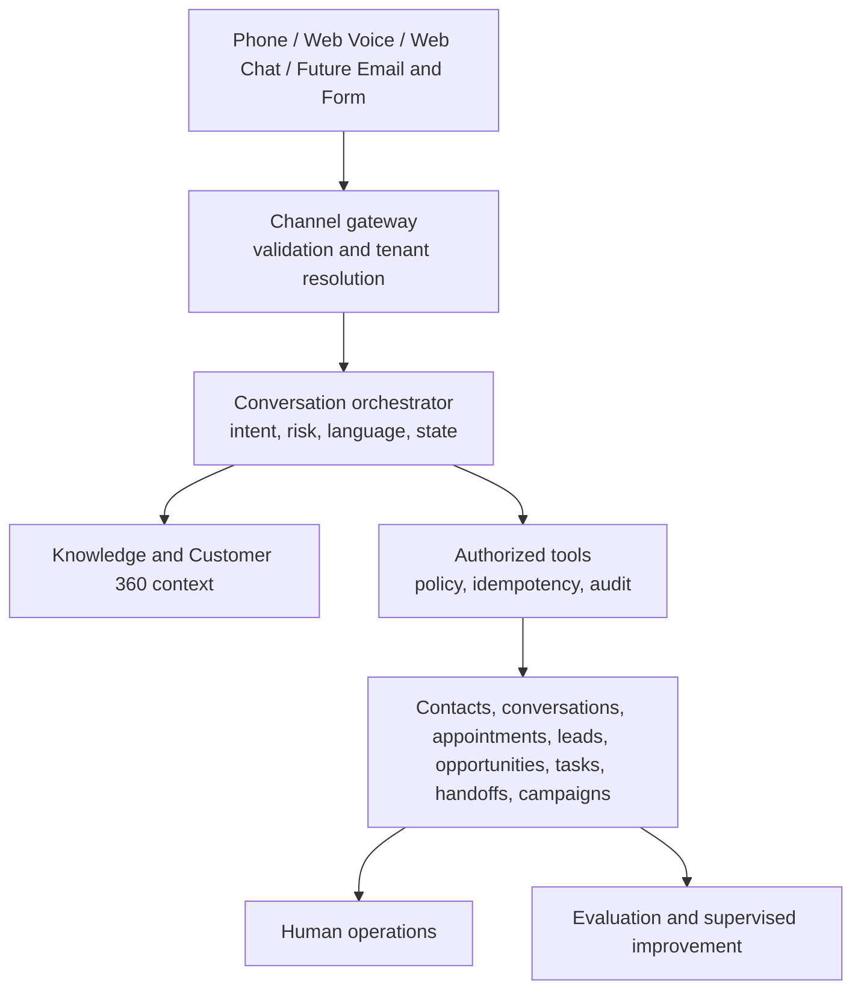

# VoxDesk AI

**AI customer operations infrastructure for voice, chat, and authorized business workflows.**

[](https://github.com/arslanvuzmal/voxdesk-ai/actions/workflows/ci.yml)
[](LICENSE)
[](https://nextjs.org/)
[](https://www.typescriptlang.org/)

[Live demo](https://voxdesk-ai.vercel.app) · [Architecture](docs/architecture/overview.md) · [Documentation](docs/README.md) · [Security](SECURITY.md) · [Roadmap](ROADMAP.md)

VoxDesk turns customer conversations into tenant-scoped, authorized operational state: contacts, conversations, appointments, opportunities, tasks, follow-ups, handoffs, and audit evidence. It is designed to evolve from AI reception into a controlled customer-service operating layer.

## Public demo and production activation

The public portfolio uses `TELEPHONY_MODE=simulation`. A deterministic simulator sends normalized events through VoxDesk's call-state, authorization, persistence, CRM, and audit paths. It never purchases a number or places a PSTN call.

The production architecture keeps **ElevenLabs** as the realtime conversational layer and **Telnyx** as the PSTN/SIP layer. Live calling is activation-required: it needs customer-owned Telnyx resources, configured ElevenLabs SIP, verified webhooks, and authorized provider tests. A configured value is not treated as verified connectivity.

| Capability                             | Implemented | Public demo             | Production              |
| -------------------------------------- | ----------- | ----------------------- | ----------------------- |
| Conversation, CRM, tasks, appointments | Yes         | Database-dependent      | Yes                     |
| Web voice                              | Yes         | Configuration-dependent | Configuration-dependent |
| Web text                               | Yes         | Configuration-dependent | Yes                     |
| Telephony simulation                   | Yes         | Database-dependent      | N/A                     |
| Telnyx adapter                         | Yes         | N/A                     | Activation-required     |
| Inbound and outbound PSTN architecture | Yes         | Simulated lifecycle     | Activation-required     |
| Human handoff state                    | Yes         | Simulated lifecycle     | Configuration-dependent |
| Campaign controls                      | Yes         | Dry run/simulation      | Activation-required     |
| Support cases/tickets                  | Planned     | Planned                 | Planned                 |

## Architecture



The model can request an action. VoxDesk validates the conversation context, tenant, role, policy, schema, and idempotency before any domain service or provider performs it. See [tool authorization](docs/security/tool-authorization.md).

## Customer interaction lifecycle

```mermaid
sequenceDiagram
  participant C as Customer
  participant G as Channel gateway
  participant O as Orchestrator
  participant T as Tool gateway
  participant D as Operations domain
  participant Q as Quality system

  C->>G: Voice, chat, or phone interaction
  G->>O: Resolve tenant, contact, channel, conversation
  O->>O: Assemble context; determine intent and risk
  O->>T: Request a scoped action
  T->>T: Validate context, policy, permissions, idempotency
  T->>D: Persist authorized business action
  D-->>O: Safe result and audit evidence
  O->>D: Finalize outcome and follow-up
  D->>Q: Evaluate and create observations
```

## What is in the repository

- Canonical `Conversation` domain across phone, website voice, and web text
- Tenant isolation, workspace roles, signed conversation context, and server-owned tools
- Contact, lead/opportunity, appointment, task, follow-up, handoff, campaign, and provider-event models
- Telnyx provider boundary, signed webhook ingestion, reconciliation, and controlled outbound architecture
- ElevenLabs agent/post-call boundary and web voice support
- Deterministic simulation mode with explicit `SIMULATION` records and `sim_` identifiers
- Evaluation, proposal, candidate, canary, promotion, and rollback lifecycle

## Technology

Next.js App Router, TypeScript, Prisma, PostgreSQL, Redis-compatible leases, ElevenLabs, Telnyx, Zod, Vitest, Playwright, and Vercel.

## Quick start

```bash
git clone https://github.com/arslanvuzmal/voxdesk-ai.git
cd voxdesk-ai
npm ci
cp .env.example .env.local
npx prisma migrate dev
npm run dev
```

`DATABASE_URL` is required for persisted application behavior. Simulation is the default telephony mode. Do not place credentials in source control.

## Verification

```bash
npx prisma validate
npm run format:check
npm run lint
npm run typecheck
npm run test:unit
npm run test:integration
npm run test:security
npm run audit:routes
npm run build
npm run test:e2e
```

Live provider commands are manual, separately authorized checks. A green build or Vercel preview is not proof of provider, migration, or production acceptance.

## Documentation map

Start at [docs/README.md](docs/README.md). It links product scope, architecture, provider activation, security, operations, testing, ADRs, and the public demo contract.

## Contributing and support

Read [CONTRIBUTING.md](CONTRIBUTING.md) before opening a change. Report vulnerabilities privately through [SECURITY.md](SECURITY.md). For product support and issue expectations, see [SUPPORT.md](SUPPORT.md).

## License

[MIT](LICENSE)
