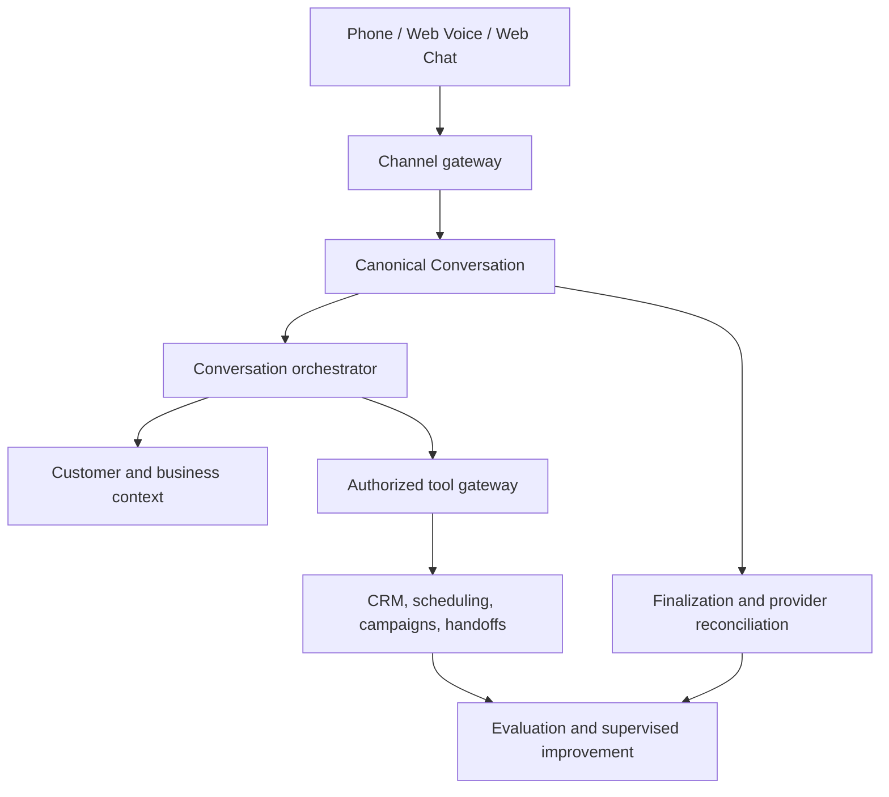

# VoxDesk

## AI Customer Operations Infrastructure

VoxDesk turns customer conversations into controlled, tenant-scoped operations: CRM records, appointments, opportunities, tasks, follow-ups, campaigns, human handoffs, and audit evidence.

[](https://github.com/arslanvuzmal/VoxDesk/actions/workflows/ci.yml)
[](LICENSE)
[](https://nextjs.org/)
[](https://www.typescriptlang.org/)

[Live demo](https://vox-desk-hybty8pq0-arslan-vuzmal-lone.vercel.app) · [Rendered docs](https://vox-desk-hybty8pq0-arslan-vuzmal-lone.vercel.app/docs) · [Architecture](docs/architecture/overview.md) · [Security](SECURITY.md) · [Roadmap](ROADMAP.md)

> The hosted application is a portfolio deployment. Dashboard routes require an account, and provider-backed voice requires separately configured, authorized resources.

## What VoxDesk is

VoxDesk is an application layer for customer operations, not an unrestricted chatbot or an unverified telephony claim. Channels enter a canonical `Conversation` model; server-side policy and domain services decide whether a tool may run; authorized actions become CRM and operational records.

The current provider boundary is:

- **ElevenLabs** — realtime conversational agent and web-voice provider boundary.
- **Telnyx** — PSTN/SIP carrier boundary for live telephony.
- **VoxDesk** — tenant isolation, authorization, CRM state, scheduling, campaigns, audit, and reconciliation.

## Demo versus production

Simulation is the safe default. It produces explicit simulated records and exercises normalization, state transitions, authorization, persistence, CRM projections, and audit paths without purchasing numbers or placing PSTN calls.

Live provider operation is activation-required. It depends on customer-owned resources, correct environment variables, signed webhooks, consent and suppression controls, provider readiness, and authorized tests. A configured key or a successful build is not proof of live connectivity.

| Capability                    | Repository status     | Portfolio/demo status | Live production status             |
| ---------------------------- | --------------------- | --------------------- | ---------------------------------- |
| Conversations and CRM records | Implemented           | Database-dependent    | Implemented with configured database |
| Web text                      | Implemented           | Configuration-dependent | Configuration-dependent          |
| Web voice                     | Implemented           | Configuration-dependent | Configuration-dependent         |
| Telephony simulation          | Implemented           | Safe default          | Not applicable                    |
| Telnyx PSTN/SIP adapter       | Implemented boundary  | Not used              | Activation-required              |
| Campaign controls             | Implemented boundary  | Dry run/simulation    | Activation-required              |
| Support cases/tickets         | Roadmap               | Not available         | Roadmap                          |

## Architecture



A model may propose an action, but it cannot directly write business data. VoxDesk resolves the workspace and conversation again, validates policy and schema, checks idempotency, executes through a domain service, and records safe audit evidence.

See the detailed [architecture overview](docs/architecture/overview.md) and [tool-authorization model](docs/security/tool-authorization.md).

## Features

- Canonical conversations across phone, web voice, and web text.
- Tenant-scoped authentication, authorization, and workspace isolation.
- Server-owned tools with policy decisions, approvals, idempotency, and audit records.
- CRM projections for contacts, leads, opportunities, appointments, tasks, follow-ups, campaigns, and handoffs.
- ElevenLabs web-voice boundary and post-call reconciliation.
- Telnyx inbound/outbound architecture with consent, suppression, calling-window, attempt, and capacity controls.
- Deterministic simulation mode for safe acceptance testing.
- Evaluation and supervised improvement lifecycle with proposal, canary, promotion, and rollback states.

## Tech stack

Next.js App Router, TypeScript, Prisma, PostgreSQL, Redis-compatible leases, Zod, Vitest, Playwright, ElevenLabs, Telnyx, and Vercel.

## Quick start

```bash
git clone https://github.com/arslanvuzmal/VoxDesk.git
cd VoxDesk
npm ci
cp .env.example .env.local
npx prisma migrate dev
npm run dev
```

Set `DATABASE_URL` for persisted behavior. Keep `TELEPHONY_MODE=simulation` unless live provider activation has been explicitly configured and tested. Never commit credentials or real customer data.

## Verification

```bash
npx prisma validate
npm run format:check
npm run lint
npm run typecheck
npm run test:unit
npm run test:integration
npm run test:security
npm run audit:routes
npm run build
npm run test:e2e
```

Run the broad `npm run verify` command when local database and browser prerequisites are available. Provider, migration, and production acceptance remain separate checks.

## Documentation

- [Documentation portal](docs/README.md)
- [Architecture](docs/architecture/overview.md)
- [Customer operations and CRM](https://vox-desk-hybty8pq0-arslan-vuzmal-lone.vercel.app/docs/crm)
- [Simulation versus production](docs/DEMO_VS_PRODUCTION.md)
- [Provider activation](docs/guides/activate-live-telephony.md)
- [Security and tool authorization](docs/security/tool-authorization.md)
- [Testing strategy](docs/testing/strategy.md)
- [Official integration references](docs/reference/official-links.md)

The rendered documentation pages are available from the hosted [documentation hub](https://vox-desk-hybty8pq0-arslan-vuzmal-lone.vercel.app/docs). They are protected by the deployment's access controls where applicable.

## Security

Report vulnerabilities privately using [GitHub Security Advisories](https://github.com/arslanvuzmal/VoxDesk/security/advisories/new). Do not include credentials, raw transcripts, full phone numbers, or customer data in issues, pull requests, logs, or screenshots. See [SECURITY.md](SECURITY.md).

## Roadmap

The roadmap is capability-based, not a delivery promise. The next product areas are support cases and tickets, human queues and internal notes, SLA operations, email/form/messaging adapters, published quality scorecards, and authorized live-telephony acceptance evidence.

See [ROADMAP.md](ROADMAP.md) for the maintained checklist.

## Contributing

Read [CONTRIBUTING.md](CONTRIBUTING.md) before opening a pull request. Use the pull-request template, describe database/provider/security impact, and report exactly which checks ran. Keep simulation and live-provider claims distinct.

## License

VoxDesk is released under the [MIT License](LICENSE).
