<div align="center">
  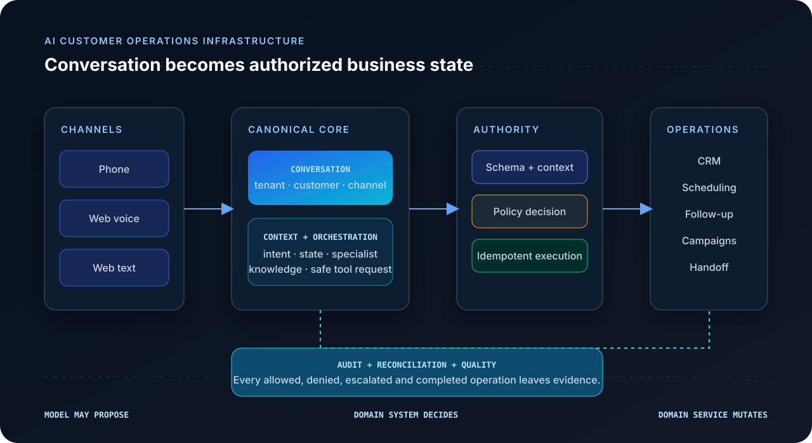

# VoxDesk

### AI Customer Operations Infrastructure

Turn customer conversations into controlled, tenant-scoped CRM, scheduling, follow-up, campaign, and handoff operations—without giving a language model direct authority over business state.

[Demo](https://vox-desk.vercel.app/demo) · [Architecture](docs/architecture/overview.md) · [Security](docs/security/overview.md) · [Documentation](docs/README.md) · [Quickstart](#local-development)

[](https://github.com/arslanvuzmal/VoxCircuit/actions/workflows/ci.yml)
[](https://nextjs.org/)
[](https://www.typescriptlang.org/)
[](docker-compose.yml)
[](#what-the-test-suite-protects)
[](LICENSE)
</div>

> **The model may propose. The domain system decides. The domain service mutates.**
>
> Language-model output is treated as a request for authority—not authority itself.

VoxDesk is the public product name. The source repository remains [`arslanvuzmal/VoxCircuit`](https://github.com/arslanvuzmal/VoxCircuit), so clone paths and CI links intentionally use `VoxCircuit`.

## Contents

- [Why VoxDesk](#why-voxdesk)
- [How VoxDesk works](#how-voxdesk-works)
- [Customer operations map](#customer-operations-map)
- [System architecture](#system-architecture)
- [Canonical conversations](#canonical-conversations)
- [Authorized business actions](#authorized-business-actions)
- [Policy, approval, and idempotency](#policy-approval-and-idempotency)
- [CRM and operational state](#crm-and-operational-state)
- [Voice, telephony, and simulation](#voice-telephony-and-simulation)
- [Campaign controls](#campaign-controls)
- [Audit and supervised quality](#audit-and-supervised-quality)
- [Security model](#security-model)
- [Data architecture](#data-architecture)
- [Product surfaces](#product-surfaces)
- [Technical specifications](#technical-specifications)
- [Testing](#what-the-test-suite-protects)
- [Deployment](#deployment-architecture)
- [Local development](#local-development)
- [Design principles](#design-principles)
- [Documentation](#documentation-map)

## How VoxDesk works

A customer enters through phone, web voice, or authenticated web text. Channel-specific transport is normalized around one `Conversation`; phone activity also receives a `Call` projection. VoxDesk then resolves the workspace and customer context, routes the interaction to a bounded specialist, and lets the agent request—not perform—a business operation.

1. Resolve the authenticated workspace, business, contact, agent, channel, direction, and language.
2. Persist or resume the canonical `Conversation` and its compact `ConversationState`.
3. Interpret intent and select a scoped specialist such as scheduling, qualification, support, or escalation.
4. Receive a proposed tool call from the conversational layer.
5. Validate the tool schema and verify a signed, short-lived `ConversationContext`.
6. Re-resolve the conversation and every tenant-owned resource from the database.
7. Evaluate session-aware policy as `ALLOW`, `DENY`, or `ESCALATE`.
8. For escalated work, require an authorized human decision bound to the payload fingerprint.
9. Check the semantic operation fingerprint and return a previous safe result when the same action already succeeded.
10. Execute an authorized mutation through a domain service inside a serializable transaction.
11. Persist the operational result and safe audit evidence.
12. Reconcile asynchronous provider events into canonical state.
13. Feed recorded outcomes into evaluation and human-supervised release controls.

<p align="center">
  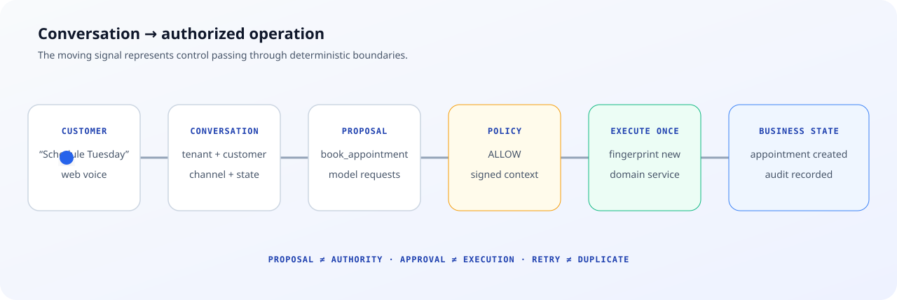
</p>

### Customer view vs. operations view

| Customer view                          | VoxDesk view                                                  |
| -------------------------------------- | ------------------------------------------------------------- |
| “Schedule a consultation for Tuesday.” | Authenticated workspace and canonical conversation            |
| Appointment confirmation               | Customer, agent, language, availability, and channel context  |
| One coherent response                  | Proposed `book_appointment` tool call                         |
| —                                      | Schema validation and signed-context verification             |
| —                                      | `ALLOW`, `DENY`, or `ESCALATE` policy decision                |
| —                                      | Fingerprint lookup and execute-once semantics                 |
| —                                      | Appointment, conversation state, and audit evidence persisted |

## Why VoxDesk

A chatbot returns text. A customer-operations system changes business state.

Once an assistant can create appointments, update contacts, open opportunities, schedule callbacks, record opt-outs, or request human handoff, response quality is only one part of the engineering problem. The system must also control tenant identity, action authority, retries, duplicate provider events, consent, suppression, human review, and operational traceability.

VoxDesk separates those responsibilities:

| Failure mode                                      | Deterministic boundary                                                            |
| ------------------------------------------------- | --------------------------------------------------------------------------------- |
| A model invents or modifies an action payload     | Zod schema validation and a canonical payload fingerprint                         |
| A caller supplies another workspace’s resource ID | Server-side membership checks and tenant-scoped re-resolution                     |
| A risky action should not execute immediately     | Session-aware policy returns `ESCALATE` and creates a bounded approval request    |
| A network or agent retry repeats an operation     | Unique action and operation fingerprints return the original safe result          |
| A provider webhook is forged or replayed          | Raw-body signature verification, timestamp tolerance, and provider-event identity |
| A campaign targets an ineligible recipient        | Consent, suppression, calling-window, country, attempt, and capacity gates        |
| Provider state diverges from business state       | Event inbox, asynchronous projection, and reconciliation                          |
| An evaluation suggests an unsafe change           | Human review, golden-suite gates, canary evidence, promotion, and rollback        |

The important boundary is not “AI versus no AI.” It is **reasoning versus authority**. VoxDesk keeps authority in tenant-scoped, testable application logic.

## Customer operations map

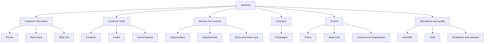

### Core capabilities

| Plane        | Implemented capability                                                                                       | Why it exists                                                               |
| ------------ | ------------------------------------------------------------------------------------------------------------ | --------------------------------------------------------------------------- |
| Conversation | Phone, web voice, and web text converge on `Conversation`                                                    | Business workflows remain channel-independent.                              |
| Context      | Persisted `ConversationState` stores intent, specialist, collected fields, risk flags, and safe tool results | Workflow state does not depend on transcript text alone.                    |
| Authority    | Signed context, schema validation, tenant re-resolution, policy, and approvals                               | The model cannot turn a plausible payload into permission.                  |
| Integrity    | Action IDs, canonical SHA-256 fingerprints, execution states, and unique constraints                         | Provider and agent retries do not duplicate semantic operations.            |
| CRM          | Contacts, leads, opportunities, appointments, tasks, follow-ups, and handoffs                                | Conversations create durable operational records outside model context.     |
| Outreach     | Campaign, recipient, attempt, consent, suppression, window, country, and capacity controls                   | Outbound work is evaluated before a provider request.                       |
| Providers    | ElevenLabs conversational boundary, Telnyx PSTN/SIP boundary, explicit simulation provider                   | External services remain adapters rather than the source of business truth. |
| Reliability  | Provider-event inbox, background jobs, bounded retries, reconciliation, and correlation IDs                  | Asynchronous delivery becomes inspectable state.                            |
| Quality      | Evaluations, observations, proposals, candidates, canaries, promotions, and rollback records                 | Improvement is reviewed and gated rather than silently self-modifying.      |

## System architecture

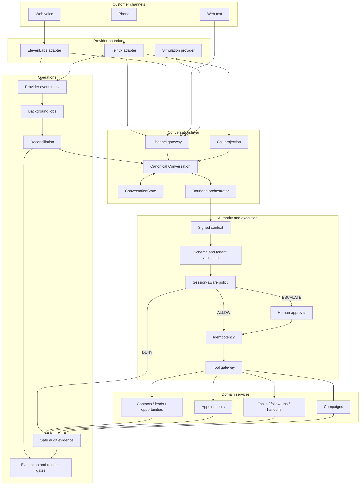

The architecture has two coupled paths:

- The **control path** configures workspaces, businesses, agents, training packs, language profiles, providers, campaign controls, policies, approvals, and permissions.
- The **execution path** normalizes an interaction, assembles context, requests a tool, evaluates authority, executes once, persists state, and reconciles provider evidence.

## Canonical conversations

<p align="center">
  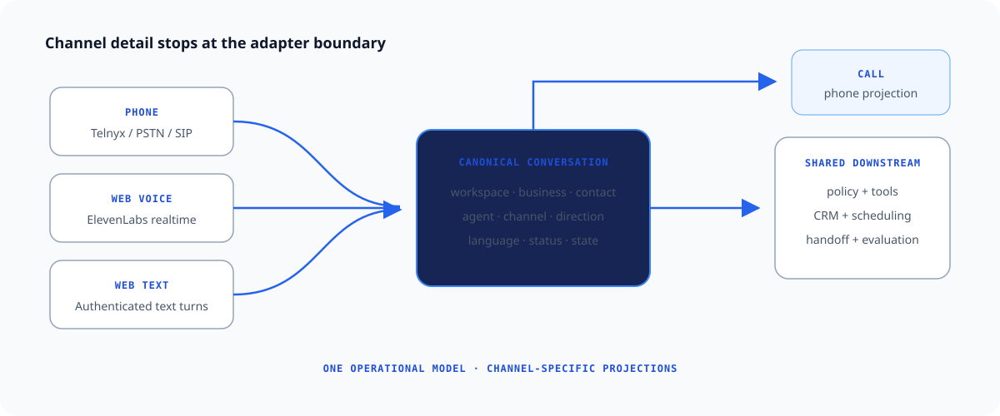
</p>

`Conversation` is the shared operational aggregate for the three implemented channels: `PHONE`, `WEB_VOICE`, and `WEB_TEXT`. It carries workspace and business ownership, optional contact context, direction, status, agent and configuration versions, language, provider correlation, summary, outcome, review state, and lifecycle timestamps.

A `Call` is a **phone-specific projection**. It retains carrier-facing details such as provider call identifiers, legs, participants, call events, recording consent, and execution mode. That distinction prevents PSTN concepts from leaking into web-text or web-voice business logic.

The persisted conversation lifecycle moves from `CREATED` to `ACTIVE`, then through `HUMAN_HANDOFF` or `FINALIZING` where required, and ends in `COMPLETED` or `FAILED`.

Provider-specific call state is normalized separately, then reconciled back into the canonical conversation and phone projection.

## Authorized business actions

The conversational layer can request thirteen database-backed tools:

`create_or_update_contact`, `check_availability`, `book_appointment`, `reschedule_appointment`, `cancel_appointment`, `create_opportunity`, `update_opportunity`, `create_task`, `complete_task`, `schedule_callback`, `create_follow_up`, `record_opt_out`, and `request_human_handoff`.

Every side effect follows the same server-owned boundary:

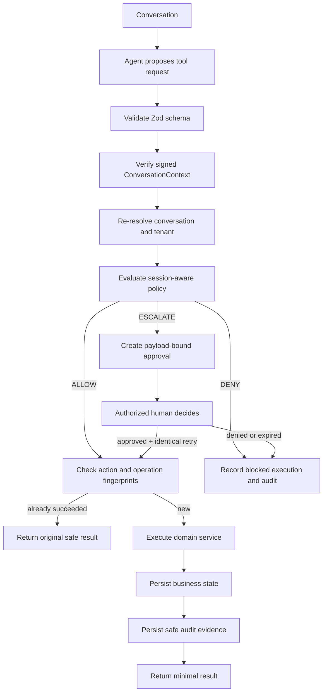

### Model authority

| The model can                                 | The model cannot directly                                     |
| --------------------------------------------- | ------------------------------------------------------------- |
| Interpret a customer turn                     | Select or grant a workspace                                   |
| Propose a supported tool and arguments        | Mutate CRM or scheduling records                              |
| Compose a customer response from safe results | Bypass policy or tenant re-resolution                         |
| Request a human handoff                       | Approve its own escalated request                             |
| Continue after an authorized tool result      | Override fingerprints, unique constraints, or execution state |

The signed `ConversationContext` is an HS256 JWT with a five-minute default lifetime. Its subject is the conversation ID; its claims bind workspace, business, optional contact, agent, agent version, training-pack version, channel, direction, and language. The server then verifies those values against the persisted conversation instead of trusting the token alone.

## Policy, approval, and idempotency

<p align="center">
  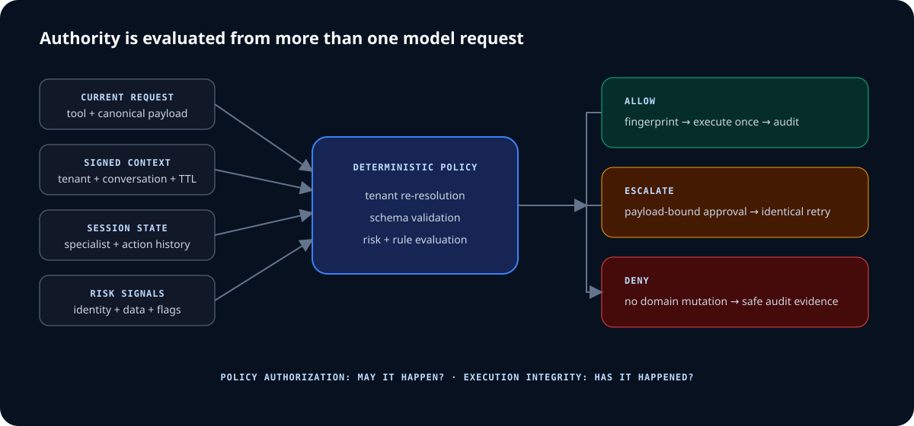
</p>

### Session-aware policy

Policy receives the current tool request plus persisted context: identity-verification state, current specialist, recent tool decisions, accessed data categories, sensitive-field categories, risk and compliance flags, external-communication risk, and mutation risk. `record_opt_out` and `request_human_handoff` receive explicit safe handling; suppression and risk rules can block or escalate other actions.

The result is a versioned decision with outcome, risk level, risk score, fired policy identifiers, and reason codes. These fields are persisted with the execution record and audit event.

### Human approval

**Approval is not execution.** An escalated tool request creates a `ToolApprovalRequest` with a 15-minute expiry. The approval binds the tenant, conversation, action, tool, execution record, policy evidence, and payload fingerprint; it does not store the raw tool payload.

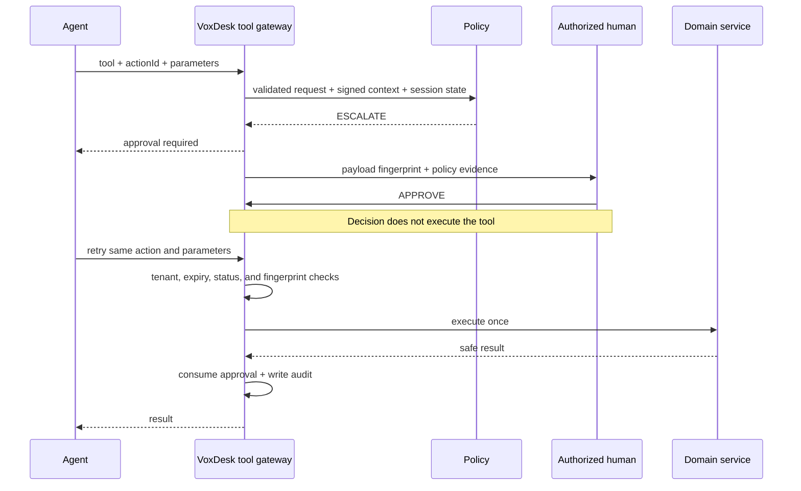

Only a workspace member with `tools:approve` can decide. A changed payload produces a different fingerprint and therefore requires a new authorization decision.

### Semantic idempotency

Policy authorization answers **“may this happen?”** Execution integrity answers **“has this semantic action already happened?”** They are different controls.

The executor canonicalizes the tool name and parameters, computes a SHA-256 fingerprint, and looks up prior execution state. A new operation enters a serializable domain transaction; an already successful operation returns its stored safe result; a conflicting execution state is rejected. `ConversationToolExecution` enforces uniqueness for `(conversationId, actionId)` and `(conversationId, operationFingerprint)`. Canonicalization sorts object keys and normalizes supported values such as email addresses, phone numbers, and timestamps.

## CRM and operational state

VoxDesk persists business state independently from the conversational provider.

| Domain              | Records                                                                                                          | Operational role                                                        |
| ------------------- | ---------------------------------------------------------------------------------------------------------------- | ----------------------------------------------------------------------- |
| Customer            | `Contact`, `Lead`                                                                                                | Identity, communication preferences, qualification, and lifecycle state |
| Conversation        | `Conversation`, `ConversationMessage`, `ConversationState`, `Call`                                               | Canonical interaction, evidence, channel projection, and workflow state |
| Revenue and service | `Opportunity`, `Appointment`, `CalendarConnection`                                                               | Durable outcomes created through authorized tools                       |
| Work                | `Task`, `FollowUp`, `Handoff`, `Notification`                                                                    | Work that survives beyond a generated response                          |
| Outreach            | `Campaign`, `CampaignRecipient`, `OutboundAttempt`                                                               | Controlled outbound execution and recipient state                       |
| Configuration       | `VoiceAgent`, `AgentVersion`, `BusinessTrainingPack`, `LanguageProfile`                                          | Versioned behavior and language readiness                               |
| Governance          | `ConversationToolExecution`, `ToolApprovalRequest`, `AuditLog`                                                   | Policy evidence, execution integrity, and decisions                     |
| Quality             | `CallEvaluation`, `EvaluationSuite`, `EvaluationRun`, `DeploymentCandidate`, `AgentDeployment`, `RollbackRecord` | Supervised evidence and release lifecycle                               |

### Scheduling, work, and handoff

Scheduling tools check availability before creating or modifying appointments and persist the conversation relationship. Tasks, callbacks, and follow-ups convert a customer turn into owned work. A handoff is a record with requested, initiated, and provider-confirmed state; live transfer is not presented as complete merely because the model requested it.

### Leads and opportunities

Qualification logic and collected fields can create or update tenant-scoped lead and opportunity records. Those records are operational projections—not claims that an opaque model score is authoritative. Conversation, appointment, task, and opportunity relationships keep the customer journey queryable after the realtime session ends.

## Voice, telephony, and simulation

<p align="center">
  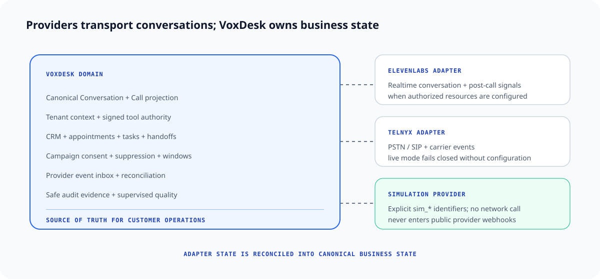
</p>

### Provider ownership

| Boundary            | Owns                                                                                                              | Does not own                                                        |
| ------------------- | ----------------------------------------------------------------------------------------------------------------- | ------------------------------------------------------------------- |
| VoxDesk             | Tenant context, canonical conversations, CRM, scheduling, campaign controls, authorization, audit, reconciliation | Carrier transport or realtime speech turns                          |
| ElevenLabs adapter  | Realtime conversational execution and post-call signals when configured                                           | VoxDesk customer records, policy decisions, or domain mutations     |
| Telnyx adapter      | PSTN/SIP transport, phone-number resources, call-control primitives, and carrier events when configured           | CRM, appointment, campaign, or approval truth                       |
| Simulation provider | Deterministic internal call records with explicit `sim_*` identifiers                                             | External network calls, number assignment, public provider webhooks |

`TELEPHONY_MODE` defaults to `simulation`. Switching to `live` fails closed unless the repository’s required Telnyx, ElevenLabs, database, and application URL configuration is present. An adapter or credential is not described as verified live connectivity; provider activation remains an explicit operational test.

### Deterministic simulation

Simulation creates visibly prefixed records and uses internal service calls. It never opens a carrier connection, assigns a phone number, calls Telnyx, or enters public provider-webhook routes. This provides reproducible normalization, state-transition, persistence, CRM-projection, and audit exercises without placing paid PSTN calls.

Both paths converge after normalization: simulation supplies an internal synthetic event, while a configured provider supplies a signed and deduplicated event. From that boundary forward, the canonical conversation, policy, domain services, audit, and reconciliation contracts are shared.

### Webhook and reconciliation path

Telnyx webhooks are verified against the raw request body using Ed25519, the signed timestamp is constrained to a five-minute window, and provider event identity supplies deduplication. ElevenLabs post-call callbacks use HMAC-SHA256 with a five-minute tolerance. Accepted events are written to the provider-event inbox and acknowledged before slower projection work runs.

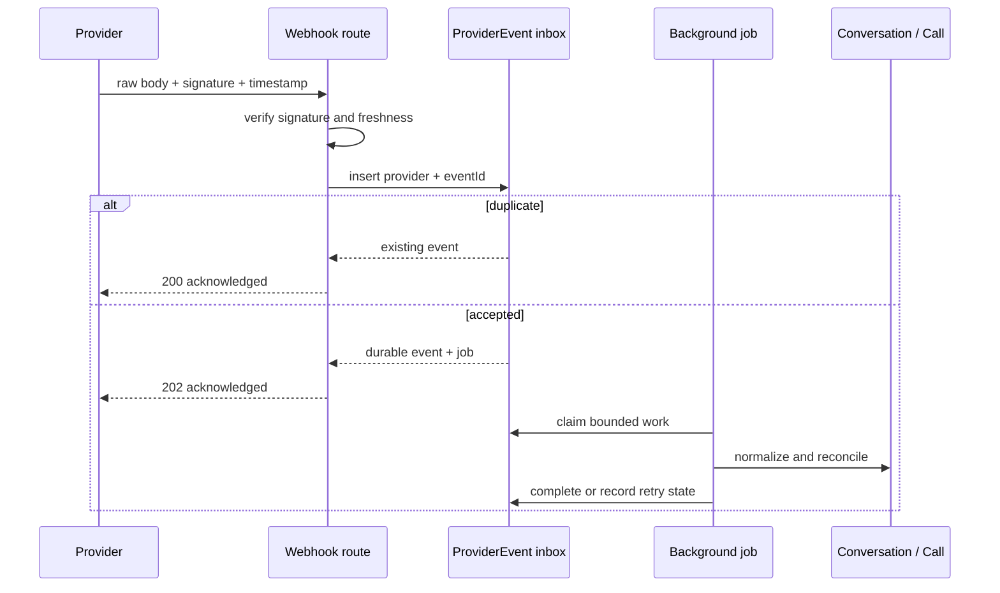

## Campaign controls

Outbound campaign execution is evaluated in deterministic application logic before a provider request.

The gate order is: valid encrypted number and lookup hash → granted outbound-call consent → no suppression, opt-out, or DNC flag → recipient-timezone calling window → attempt and supported-country checks → concurrency lease and throttle → approved campaign state → queued provider request.

`CampaignReadiness` reports total and eligible recipients plus invalid-number, missing-consent, suppression, window, attempt-limit, and unsupported-country counts. Campaigns define a local calling window, maximum attempts, retry interval, concurrency limit, calls-per-minute limit, supported countries, approval state, and dry-run state.

Redis-backed leases enforce scoped limits for tenant, business, agent, phone number, campaign, connection, and global capacity. Outbound capacity preserves an inbound reserve. Production fails closed when the Redis-compatible lease store is unavailable; local development has an in-process fallback.

The outbound worker claims jobs atomically, rechecks campaign and recipient authorization, re-evaluates readiness immediately before provider execution, and uses the attempt ID as the provider idempotency key. Retryable failures return to the queue with bounded attempts; compliance failures are blocked.

## Audit and supervised quality

### Every action leaves safe evidence

```text
correlationId
└─ conversationId
   ├─ tool + actionId
   ├─ policy outcome + version
   ├─ risk level + risk score
   ├─ triggered policy IDs + reason codes
   ├─ payload fingerprint
   ├─ approval decision / approver when applicable
   ├─ execution state + safe result
   └─ domain record + audit event
```

Audit evidence is intentionally narrower than raw activity capture. The tool boundary records correlation, tenant, conversation, agent, specialist, action, policy, risk, reason, fingerprint, and approval metadata while excluding credentials, full transcripts, and raw sensitive values.

### Supervised improvement

VoxDesk does not let conversation analysis mutate production agent behavior automatically.

```mermaid
flowchart LR
  O[Recorded outcome] --> E[Evaluation]
  E --> OB[Observation]
  OB --> PR[Improvement proposal]
  PR --> HR[Human review]
  HR --> C[Immutable candidate]
  C --> G[Golden evaluation suites]
  G --> CA[Canary]
  CA --> HP[Human promotion]
  HP --> M[Measured deployment]
  M -->|gate failure| RB[Rollback to previous deployment]
```

A candidate needs approved evaluation-suite evidence. The gate rejects missing suites, failed results, or critical failures. Canary completion checks the configured conversation minimum, zero critical failures, and absence of a detected regression. Promotion atomically deactivates the previous production deployment and activates the verified candidate; rollback restores the most recent available production deployment and records the reason.

This is a **human-supervised release lifecycle**, not a self-modifying agent claim.

## Security model

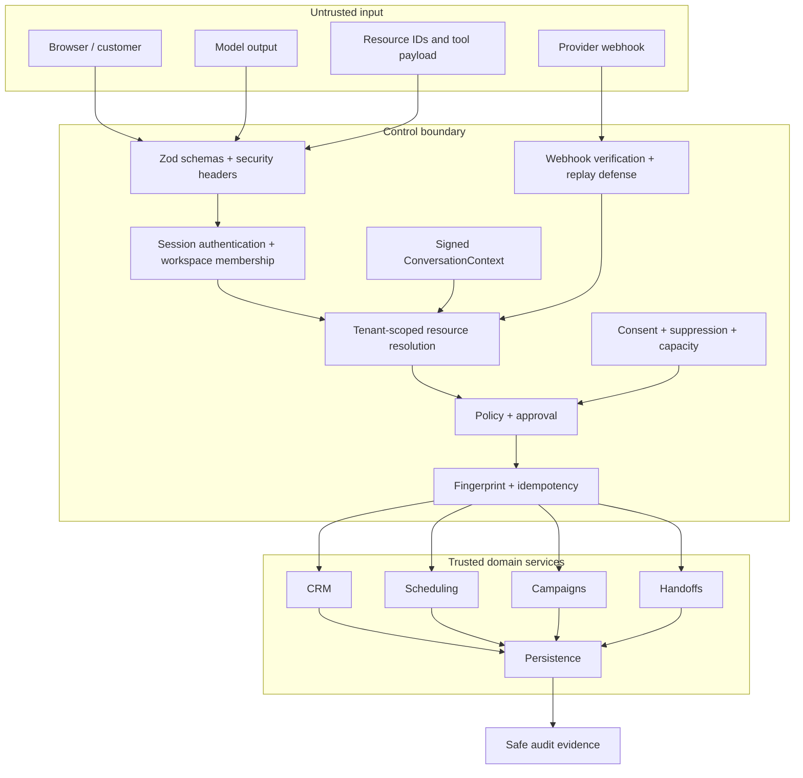

The critical invariant is: **resource IDs do not grant access**. An ID supplied by the browser, provider, or model is resolved again under the authenticated workspace. Unauthorized and cross-tenant lookups use not-found responses where appropriate, reducing resource-enumeration signals.

| Surface             | Threat                              | Verified control                                                                                                            |
| ------------------- | ----------------------------------- | --------------------------------------------------------------------------------------------------------------------------- |
| Passwords           | Offline credential disclosure       | `bcrypt` with cost 10                                                                                                       |
| Sessions            | Plaintext token disclosure          | 256-bit opaque token; SHA-256 stored server-side; seven-day expiry; `httpOnly`, `sameSite=lax`, secure-in-production cookie |
| Tenant data         | BOLA / cross-workspace access       | Session → membership → permission → workspace-scoped query                                                                  |
| Tool context        | Forged workspace, contact, or agent | Five-minute HS256 context plus persisted-field re-resolution                                                                |
| Tool payload        | Mutation or replay                  | Zod validation, canonical SHA-256 fingerprint, unique action and operation constraints                                      |
| Approval            | Reuse for a modified action         | Tenant, conversation, execution, expiry, status, and payload-fingerprint binding                                            |
| Sensitive values    | Data exposure                       | AES-256-GCM encryption with random 96-bit IV; HMAC-SHA256 phone lookup; masked display                                      |
| Browser             | Injection and capability abuse      | CSP, frame denial, MIME-sniff prevention, strict referrer policy, microphone-only permission, HSTS on HTTPS deployments     |
| Telnyx webhook      | Forgery and replay                  | Ed25519 raw-body verification, timestamp tolerance, provider event identity                                                 |
| ElevenLabs callback | Forgery and replay                  | HMAC-SHA256 raw-body verification, timestamp tolerance, provider event identity                                             |
| Outbound work       | Contact or capacity abuse           | Consent, suppression, DNC, recipient timezone, country, attempt, campaign approval, and lease gates                         |
| Audit               | Secondary sensitive-data store      | Safe metadata and fingerprints rather than raw payloads, secrets, or full transcripts                                       |

VoxDesk makes no compliance-certification claim. The repository documents concrete controls and the tests that exercise their boundaries.

### Deterministic forged-request outcomes

| Condition                                              | Result                                             |
| ------------------------------------------------------ | -------------------------------------------------- |
| Missing or expired signed conversation context         | Request rejected before policy or mutation         |
| Context fields do not match the persisted conversation | Request rejected as invalid context                |
| Resource belongs to another workspace                  | Resource not found under authorized tenant scope   |
| Payload changes after human approval                   | Fingerprint mismatch; approval cannot be consumed  |
| Semantic action already succeeded                      | Original safe result returned; no second mutation  |
| Policy returns `DENY`                                  | Blocked execution and audit; no domain write       |
| Recipient is suppressed or lacks consent               | Campaign attempt blocked before provider execution |

## Data architecture

The current Prisma schema defines **65 models and 33 enums**. The diagram below intentionally shows domain relationships rather than every table.

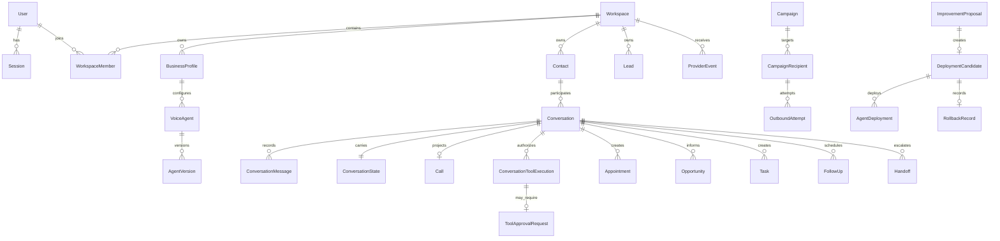

### Domain ownership

| Domain                                                             | Source of truth                                                 |
| ------------------------------------------------------------------ | --------------------------------------------------------------- |
| Conversation and workflow state                                    | VoxDesk `Conversation` and `ConversationState`                  |
| Phone-specific execution                                           | Provider state plus reconciled VoxDesk `Call` projection        |
| Customer, lead, opportunity, appointment, task, follow-up, handoff | VoxDesk tenant-scoped domain records                            |
| Policy and approval                                                | Versioned VoxDesk execution and approval records                |
| Carrier transport                                                  | Telnyx when configured; normalized into VoxDesk provider events |
| Realtime conversational turn                                       | ElevenLabs when configured; reconciled post-call evidence       |
| Simulation                                                         | Explicit VoxDesk simulation records and internal events         |

PostgreSQL holds relational tenancy, operational state, execution uniqueness, provider-event identity, jobs, and audit in one transactional model. JSON fields are used for bounded evolving payloads such as safe context, policy evidence, normalized provider data, and evaluation results—not as a substitute for tenant ownership or core relationships.

## Product surfaces

The route map below follows the current application surface and links to the public portfolio deployment without substituting generated UI for product evidence.

| Surface                        | Route                                                 | Engineering value                                                                            |
| ------------------------------ | ----------------------------------------------------- | -------------------------------------------------------------------------------------------- |
| Public workflow                | [`/demo`](https://vox-desk.vercel.app/demo)           | Demonstrates the explicitly labeled portfolio interaction path.                              |
| Operations overview            | `/dashboard`                                          | Aggregates tenant-scoped customer-operations state.                                          |
| Conversations                  | `/dashboard/conversations`                            | Unifies canonical interactions, live/escalated views, and channel-independent state.         |
| Contacts and leads             | `/dashboard/contacts`, `/dashboard/leads`             | Keeps customer and qualification records durable outside the model context.                  |
| Appointments and opportunities | `/dashboard/appointments`, `/dashboard/opportunities` | Makes authorized business outcomes independently inspectable.                                |
| Campaigns                      | `/dashboard/campaigns`                                | Surfaces campaign state and recipient controls.                                              |
| Audit                          | `/dashboard/settings/audit`                           | Exposes recorded operational evidence without treating raw transcripts as an audit strategy. |
| Improvement                    | `/dashboard/improvement`                              | Presents supervised proposals, candidates, canary evidence, promotion, and rollback state.   |

Dashboard routes require an authenticated account and configured persistence. The public portfolio environment uses explicit demo/simulation boundaries; it should not be interpreted as carrier-activation evidence.

## Technical specifications

<details>
<summary><strong>Conversation and authorization</strong></summary>

### Channels

| Specification            | Implementation                                                                                                                         |
| ------------------------ | -------------------------------------------------------------------------------------------------------------------------------------- |
| Canonical interaction    | Prisma `Conversation`                                                                                                                  |
| Implemented channels     | `PHONE`, `WEB_VOICE`, `WEB_TEXT`                                                                                                       |
| Directions               | `INBOUND`, `OUTBOUND`, `INTERACTIVE`                                                                                                   |
| Phone projection         | One optional `Call` per `Conversation`                                                                                                 |
| Persisted workflow state | `ConversationState` for identity, collected fields, specialist, tool results, risk/compliance, handoff, follow-up, and compact summary |
| Web-text boundary        | Authenticated, workspace-scoped POST route with Zod validation and workspace rate limiting                                             |
| Web-voice boundary       | Verified active ElevenLabs agent, version, training pack, language profile, and signed provider URL                                    |

### Authorization

| Specification         | Implementation                                                                                                  |
| --------------------- | --------------------------------------------------------------------------------------------------------------- |
| Tool context          | HS256 JWT; five-minute default TTL; issuer/audience bound to VoxDesk tools                                      |
| Context claims        | Conversation, workspace, business, optional contact, agent/version, training pack, channel, direction, language |
| Policy outcomes       | `ALLOW`, `DENY`, `ESCALATE`                                                                                     |
| Policy evidence       | Version, risk level/score, rule IDs, reason codes                                                               |
| Approval lifetime     | 15 minutes                                                                                                      |
| Approval authority    | Workspace permission `tools:approve`                                                                            |
| Payload binding       | SHA-256 of canonical tool name + parameters                                                                     |
| Execution transaction | Prisma serializable transaction for business mutation and execution state                                       |

### Execution integrity

| Specification     | Implementation                                                    |
| ----------------- | ----------------------------------------------------------------- |
| Caller key        | `actionId` scoped to conversation                                 |
| Semantic key      | `operationFingerprint` scoped to conversation                     |
| Duplicate success | Returns the previously stored safe result                         |
| Approval retry    | Same action and identical payload required                        |
| Concurrency race  | Unique constraints plus guarded state transitions                 |
| Result storage    | Bounded safe result; raw sensitive payload excluded from approval |

</details>

<details>
<summary><strong>Customer operations, telephony, and quality</strong></summary>

### Customer operations

| Capability  | Persisted model / tool boundary                                            |
| ----------- | -------------------------------------------------------------------------- |
| Contact     | `Contact`; create/update tool                                              |
| Lead        | `Lead`; qualification and conversation relationships                       |
| Opportunity | `Opportunity`; create/update tools                                         |
| Appointment | `Appointment` and `CalendarConnection`; check/book/reschedule/cancel tools |
| Work        | `Task`, `FollowUp`; create/complete/schedule tools                         |
| Escalation  | `Handoff`; request tool plus provider reconciliation                       |
| Campaign    | `Campaign`, `CampaignRecipient`, `OutboundAttempt`                         |
| Consent     | `ConsentRecord`, `CommunicationPreference`, `SuppressionEntry`             |

### Telephony and providers

| Specification           | Implementation                                                                              |
| ----------------------- | ------------------------------------------------------------------------------------------- |
| Default mode            | `simulation`                                                                                |
| Live-mode gate          | `TELEPHONY_MODE=live` plus required Telnyx, ElevenLabs, database, and app URL configuration |
| Realtime conversation   | ElevenLabs adapter when configured                                                          |
| PSTN / SIP              | Telnyx adapter when configured                                                              |
| Simulation safety       | No external connection, public webhook, or number assignment; `sim_*` identifiers           |
| Telnyx verification     | Ed25519 raw body + five-minute timestamp tolerance                                          |
| ElevenLabs verification | HMAC-SHA256 raw body + five-minute timestamp tolerance                                      |
| Event integrity         | Provider + provider-event ID uniqueness                                                     |
| Async processing        | Provider inbox + `BackgroundJob`; maximum attempts persisted per job                        |
| Capacity                | Upstash Redis-compatible scoped leases; inbound reserve; production fail-closed             |

### Quality

| Specification   | Implementation                                                                 |
| --------------- | ------------------------------------------------------------------------------ |
| Evidence        | `CallEvaluation`, `EvaluationSuite`, `EvaluationRun`, `ImprovementObservation` |
| Change proposal | `ImprovementProposal` with review state and rollback plan                      |
| Candidate gate  | Latest required suite runs must pass; no missing suite or critical failure     |
| Canary gate     | Minimum conversations, zero critical failures, no detected regression          |
| Promotion       | Atomic active deployment switch after gate completion                          |
| Rollback        | Restore the most recent prior production deployment and record reason          |

</details>

<details>
<summary><strong>Security, platform, and observability</strong></summary>

### Security

| Specification              | Implementation                                                                       |
| -------------------------- | ------------------------------------------------------------------------------------ |
| Password hashing           | `bcrypt`, cost 10                                                                    |
| Session token              | 32 random bytes, hex encoded; SHA-256 hash persisted                                 |
| Session cookie             | `httpOnly`, `sameSite=lax`, secure in production, seven-day lifetime                 |
| Sensitive-value encryption | AES-256-GCM, random 12-byte IV, authenticated ciphertext                             |
| Phone lookup               | E.164 normalization + HMAC-SHA256                                                    |
| Tenant isolation           | Workspace membership and permission checks followed by tenant-scoped queries         |
| Browser headers            | CSP, HSTS, frame denial, MIME protection, strict referrer, restricted permissions    |
| Audit minimization         | Safe metadata, hashes, reason codes, and IDs; no credentials or complete transcripts |

### Observability

| Specification      | Implementation                                                                           |
| ------------------ | ---------------------------------------------------------------------------------------- |
| Correlation        | IDs carried through conversations, provider events, jobs, tools, and API metadata        |
| Tool trace         | Policy, risk, rules, reasons, fingerprint, latency, status, and error category           |
| Provider trace     | Provider event, processing state, background job, reconciliation result                  |
| Health             | Application, database, integration, queue, telephony, and voice routes                   |
| Analytics surfaces | Dashboard analytics plus persisted conversation, call, campaign, and evaluation outcomes |

### Platform

| Layer                    | Technology                                                                                  |
| ------------------------ | ------------------------------------------------------------------------------------------- |
| Application              | Next.js 16 App Router, React 19, strict TypeScript 5.7                                      |
| Validation               | Zod 3                                                                                       |
| Persistence              | PostgreSQL 16 locally, Prisma 6                                                             |
| Distributed capacity     | Upstash Redis-compatible lease store                                                        |
| Styling                  | Tailwind CSS 3                                                                              |
| Voice / carrier adapters | ElevenLabs and Telnyx                                                                       |
| Tests                    | Vitest 3 and Playwright 1.50                                                                |
| Hosting model            | Vercel application, PostgreSQL, optional Redis-compatible lease service, external providers |

</details>

## What the test suite protects

The repository contains **73 test files**: 33 unit, 9 integration, 28 security, and 3 Playwright E2E specifications. This is a source-derived file count, not an invented test-case total or a claim that provider resources are active.

| Suite       | Important invariants exercised                                                                                                                                                                                                                                                                    |
| ----------- | ------------------------------------------------------------------------------------------------------------------------------------------------------------------------------------------------------------------------------------------------------------------------------------------------- |
| Unit        | Call state machine, canonical schema, calling windows, campaign readiness, concurrency leases, tool policy, payload fingerprints, orchestration, encryption, simulation/live separation, provider caller ID, and improvement gates                                                                |
| Integration | Appointment and booking tools, conversation projection, campaign queue start, Telnyx event inbox/acknowledgement, outbound worker reconciliation, ElevenLabs post-call acknowledgement, and the bounded demo call                                                                                 |
| Security    | Tenant isolation for calls/contacts/CRM/campaigns, signed conversation context, persisted-context checks, forged web voice/text requests, tool-governance boundaries, provider webhook verification, sensitive identifiers, recording policy, outbound authorization, and retired mutation routes |
| E2E         | Public/demo flow, platform architecture, and route-level browser contracts; explicitly not carrier activation                                                                                                                                                                                     |

CI uses Node.js 24 and runs Prisma validation, formatting, documentation checks, linting, type checking, production builds, route audits, unit/integration/security suites, and Chromium E2E. Paid provider calls are not part of CI.

```bash
npm run test:unit
npm run test:integration
npm run test:security
npm run test:e2e
```

The broad repository check is `npm run verify`; it expects the database and browser prerequisites required by its component commands.

## Deployment architecture

| Path              | Components                                                                                                    |
| ----------------- | ------------------------------------------------------------------------------------------------------------- |
| Delivery          | Developer → GitHub pull request → GitHub Actions → Vercel preview/deployment                                  |
| Application       | Next.js application → PostgreSQL; Redis-compatible leases when distributed capacity is exercised              |
| Provider boundary | Application ↔ configured ElevenLabs and Telnyx resources → verified webhook inbox → PostgreSQL reconciliation |

A Vercel `READY` state verifies deployment completion, not database migrations, provider activation, phone-number ownership, signed-webhook reachability, or live-call acceptance. The repository keeps those as separate health and operational checks.

## Local development

### Prerequisites

- Node.js 20 or newer; CI uses Node.js 24.
- PostgreSQL; the included Compose file runs PostgreSQL 16 on port `5432`.
- A Redis-compatible service only when exercising distributed lease and quota behavior.

```bash
git clone https://github.com/arslanvuzmal/VoxCircuit.git
cd VoxCircuit
npm ci
cp .env.example .env.local
docker compose up -d
npx prisma migrate dev
npm run dev
```

`TELEPHONY_MODE=simulation` is the safe default. Keep it in simulation unless provider-backed calling has explicitly authorized Telnyx and ElevenLabs resources, required secrets, webhook endpoints, consent policy, and acceptance tests.

<details>
<summary><strong>Configuration groups</strong></summary>

| Group        | Variables                                                                                                                                                   |
| ------------ | ----------------------------------------------------------------------------------------------------------------------------------------------------------- |
| Application  | `APP_URL`, `NEXT_PUBLIC_APP_URL`, `DATABASE_URL`                                                                                                            |
| Core secrets | `AUTH_SECRET`, `ENCRYPTION_KEY`, `INTERNAL_API_SECRET`, `DEMO_SESSION_SECRET`, `IP_HASH_SECRET`, `PHONE_HASH_SECRET`                                        |
| Mode         | `TELEPHONY_MODE` (`simulation` or `live`)                                                                                                                   |
| ElevenLabs   | `ELEVENLABS_API_KEY`, `ELEVENLABS_AGENT_ID`, `ELEVENLABS_WEBHOOK_SECRET`                                                                                    |
| Telnyx       | `TELNYX_API_KEY`, `TELNYX_PUBLIC_KEY`, `TELNYX_CONNECTION_ID`, `TELNYX_PRIMARY_PHONE_NUMBER`, `TELNYX_OUTBOUND_VOICE_PROFILE_ID`, webhook and SIP variables |
| Capacity     | `UPSTASH_REDIS_REST_URL`, `UPSTASH_REDIS_REST_TOKEN`                                                                                                        |
| Demo safety  | `DEMO_ENABLED`, `DEMO_MODE`, `DEMO_GLOBAL_KILL_SWITCH`, duration/turn limits, `CONTENT_LOGGING_MODE`                                                        |

Use [.env.example](.env.example) as the complete source of truth. Never commit credentials, raw customer data, full phone numbers, or transcripts.

</details>

## Repository structure

```text
VoxCircuit/
├── app/                         # Next.js product surfaces and API routes
│   ├── (dashboard)/dashboard/   # customer operations, audit, analytics, quality
│   └── api/                     # auth, conversations, tools, providers, health
├── components/                  # product and conversation UI
├── lib/
│   ├── auth/                    # sessions and workspace authorization
│   ├── conversation/            # orchestration, state, qualification, text path
│   ├── improvement/             # evaluation, canary, promotion, rollback gates
│   ├── security/                # signed context, governance, identifiers, webhooks
│   ├── telephony/               # contracts, adapters, simulation, inbox, campaigns
│   └── voice-agent/             # agent configuration and server-owned tools
├── workers/                     # bounded outbound campaign worker
├── prisma/                      # customer-operations schema and migrations
├── tests/                       # unit, integration, security, and E2E suites
├── docs/                        # architecture, security, operations, guides, ADRs
└── portfolio/                   # capture and presentation planning
```

## Operational invariants

| Invariant                                     | Why it exists                                                                        |
| --------------------------------------------- | ------------------------------------------------------------------------------------ |
| One canonical `Conversation`                  | Downstream operations remain independent of phone, web voice, or web text transport. |
| `Call` is a phone projection                  | Carrier detail does not distort every conversation type.                             |
| No direct model mutation                      | Language output cannot become business authority by itself.                          |
| Workspace re-resolution                       | Caller-provided IDs cannot widen tenant access.                                      |
| Authorization and idempotency are separate    | Permission does not prove an action has not already occurred.                        |
| Approval is payload-bound                     | A human decision cannot authorize a modified operation.                              |
| Approval does not execute                     | The original boundary still performs validation, fingerprint checks, and mutation.   |
| Provider events are inboxed before projection | Acknowledgement and slow reconciliation are decoupled and inspectable.               |
| Simulation is explicit                        | Portfolio activity cannot be mistaken for carrier activity.                          |
| Audit evidence is minimized                   | Traceability does not require copying secrets or full transcripts.                   |
| Improvement is supervised                     | Evaluations create evidence; humans control promotion and rollback.                  |

## Design principles

1. **Conversation is canonical; channels are adapters.** Phone, web voice, and web text share operational state while retaining the projections their transports require.
2. **Model output is a proposal, not authority.** Tool requests cross a deterministic server-owned boundary.
3. **Business state changes through domain services.** Providers and prompts do not write CRM or scheduling records directly.
4. **Tenant identity is resolved server-side.** Resource identifiers are lookup inputs, never authorization grants.
5. **Policy and execution integrity answer different questions.** An allowed action can still be a duplicate, conflict, or expired approval.
6. **Consequential actions can require human review.** Approval binds evidence and payload, then the caller retries through the same guarded path.
7. **Retries must not duplicate business operations.** Semantic fingerprints and unique constraints survive network and provider retries.
8. **Provider boundaries do not own customer operations.** External state is normalized and reconciled into VoxDesk’s canonical domain.
9. **Simulation and live execution are visibly distinct.** Shared contracts do not erase operational provenance.
10. **Audit evidence should be useful and safe.** Correlation, policy, risk, fingerprints, and outcomes matter more than raw sensitive payloads.
11. **Quality improvement is supervised.** Evaluations and observations inform immutable candidates; gated canaries, promotion, and rollback control release.

## Documentation map

| Document                                                           | What it explains                                                                       |
| ------------------------------------------------------------------ | -------------------------------------------------------------------------------------- |
| [Documentation portal](docs/README.md)                             | Complete repository documentation index                                                |
| [Architecture overview](docs/architecture/overview.md)             | System layers, ownership, and global invariants                                        |
| [System context](docs/architecture/system-context.md)              | Actors, services, state stores, and external boundaries                                |
| [Data flow](docs/architecture/data-flow.md)                        | Interaction, tool, provider-event, and reconciliation paths                            |
| [Conversation model](docs/architecture/conversation-model.md)      | Canonical conversation, phone projection, messages, and state                          |
| [Customer operations](docs/architecture/customer-operations.md)    | Domain capabilities and server-owned tool boundary                                     |
| [Provider boundaries](docs/architecture/provider-boundaries.md)    | ElevenLabs, Telnyx, storage, calendar, and CRM ownership                               |
| [Telephony](docs/architecture/telephony.md)                        | Simulation, inbound/outbound calls, provider events, and readiness                     |
| [Async processing](docs/architecture/async-processing.md)          | Event inbox, acknowledgement, jobs, retries, and leases                                |
| [Tool authorization](docs/security/tool-authorization.md)          | Signed context, policy, approval, idempotency, and audit semantics                     |
| [Outbound compliance](docs/security/outbound-compliance.md)        | Consent, suppression, windows, attempts, and campaign authority                        |
| [Webhook security](docs/security/webhooks.md)                      | Signature, replay, idempotency, and acknowledgement controls                           |
| [Security overview](docs/security/overview.md)                     | Threat-to-control map                                                                  |
| [Simulation vs. provider execution](docs/DEMO_VS_PRODUCTION.md)    | Explicit operational separation and fail-closed live mode                              |
| [Supervised improvement](docs/architecture/improvement-loop.md)    | Evaluation, candidate, canary, promotion, and rollback gates                           |
| [Testing strategy](docs/testing/strategy.md)                       | Unit, integration, security, E2E, and provider acceptance scope                        |
| [Local development](docs/guides/local-development.md)              | Prerequisites, setup, and verification                                                 |
| [Live-provider activation](docs/guides/activate-live-telephony.md) | Authorized Telnyx and ElevenLabs activation procedure                                  |
| [Architecture decisions](docs/adr/README.md)                       | Canonical conversation, provider, simulation, authorization, tenancy, and quality ADRs |

## Contributing, security, and license

Read [CONTRIBUTING.md](CONTRIBUTING.md) before opening a pull request. Report vulnerabilities privately through [GitHub Security Advisories](https://github.com/arslanvuzmal/VoxCircuit/security/advisories/new) and review [SECURITY.md](SECURITY.md) before sharing logs or reproductions.

VoxDesk is released under the [MIT License](LICENSE). Created by **Arslan Vuzmal Lone**.
