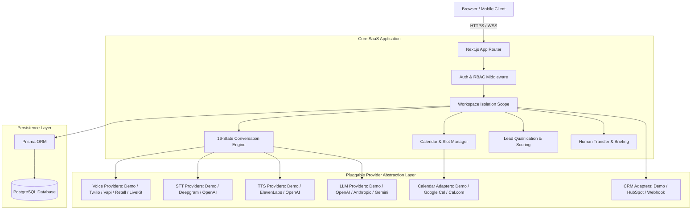
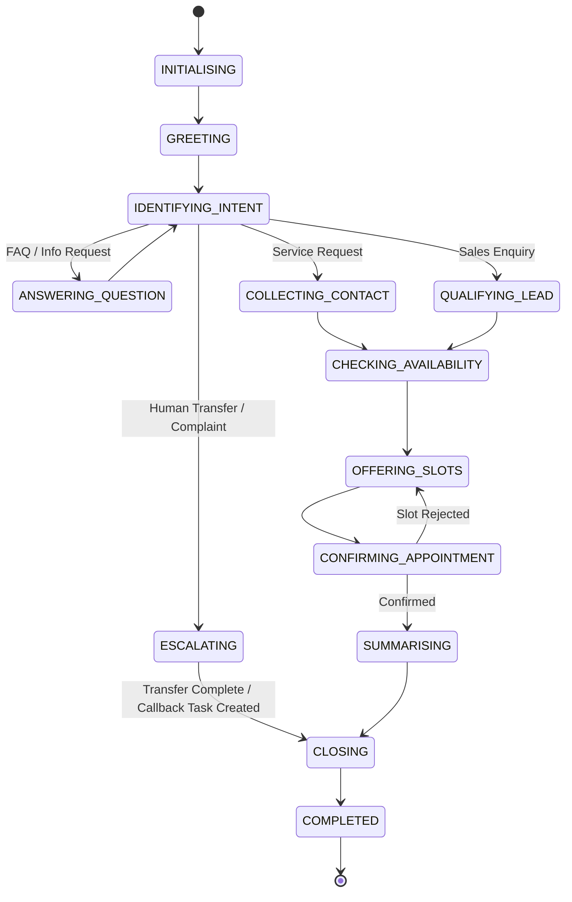
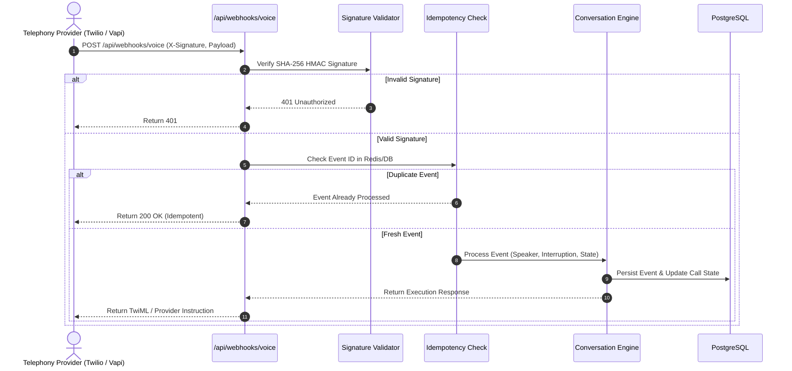

# VoxDesk AI — System Architecture & Component Specification

**Author / Owner:** Arslan Vuzmal Lone  
**Version:** 1.0.0  

---

## 1. High-Level Architecture Overview

VoxDesk AI is architected as a modular Next.js SaaS application structured around multi-tenant isolation, pluggable provider interfaces, a server-enforced conversation state engine, and a deterministic call simulator for demonstration without paid credentials.

---

## 2. Conversation State Machine Lifecycle

VoxDesk AI enforces strict conversation state transitions via a server-side state engine:

---

## 3. Telephony Webhook Security Protocol

