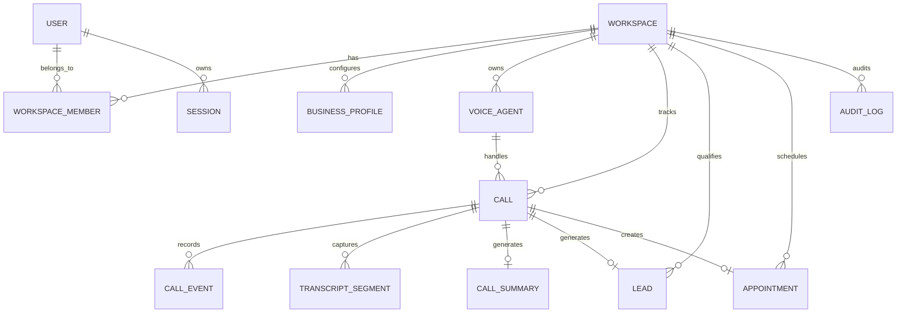

# VoxDesk AI — Database Schema Architecture & Data Model

**Author / Owner:** Arslan Vuzmal Lone  
**ORM:** Prisma ORM  
**Database:** PostgreSQL (Supabase Compatible)

---

## 1. Relational Entity ER Diagram

---

## 2. Model Inventory (22 Core Relational Tables)

1. **`User`**: User identity, hashed credentials, system status.
2. **`Session`**: HTTP-only session tokens, expiry, user relation.
3. **`Workspace`**: Multi-tenant workspace unit, slug, plan, timezone.
4. **`WorkspaceMember`**: Junction model mapping users to workspaces with RBAC roles (`OWNER`, `ADMIN`, `OPERATOR`, `ANALYST`, `VIEWER`).
5. **`Invitation`**: Pending workspace invitations and token hashes.
6. **`BusinessProfile`**: Business name, description, timezone, opening hours, holiday rules, encrypted escalation numbers.
7. **`VoiceAgent`**: Voice agent configurations, greeting instructions, prompt rules, linked calendar/CRM connections.
8. **`AgentVersion`**: Immutable version history of voice agent prompt configurations.
9. **`PhoneNumber`**: Assigned virtual phone numbers linked to voice agents.
10. **`ProviderConnection`**: Encrypted credentials for voice, STT, TTS, LLM, calendar, and CRM integrations.
11. **`KnowledgeItem`**: Business knowledge items, approved FAQ answers, emergency protocols.
12. **`QualificationRule`**: Lead scoring criteria, weights, category thresholds.
13. **`EscalationPolicy`**: Escalation rules, trigger phrases, transfer targets.
14. **`Call`**: Core call session record, duration, direction, outcome, qualification score, appointment relation.
15. **`CallEvent`**: Raw sequence events (barge-in, tool calls, state changes).
16. **`TranscriptSegment`**: Speaker-separated transcript lines with timestamps and redaction flags.
17. **`CallSummary`**: Structured summary JSON, intent, sentiment, urgency, action items, commitments.
18. **`Lead`**: Qualified lead records, contact info, BANT score breakdown, assignment status.
19. **`CalendarConnection`**: External calendar connections (Google Calendar, Cal.com, Demo).
20. **`Appointment`**: Scheduled appointments, caller contact, status, external event ID.
21. **`CRMActivity`**: Synced CRM activities, contacts, and task logs.
22. **`AuditLog`**: Append-only security audit log for all system mutations.
