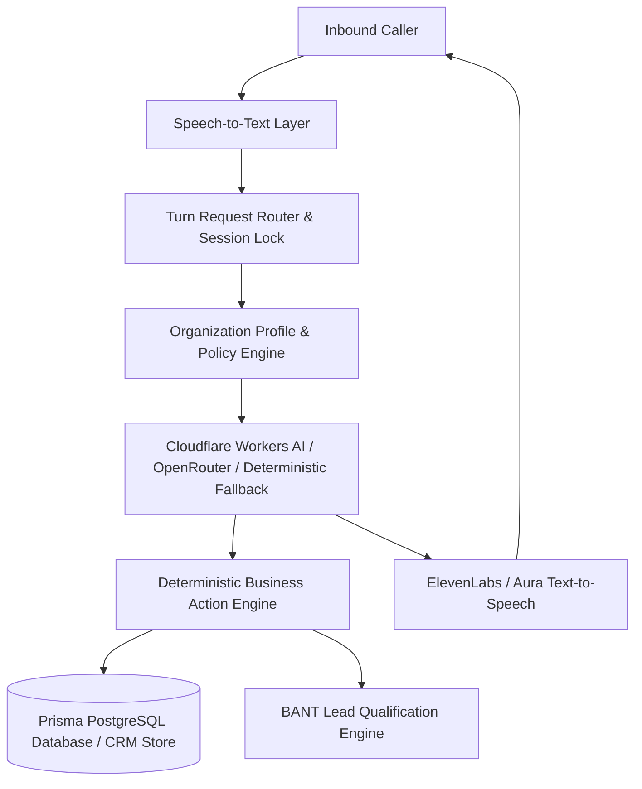

# VoxDesk AI — Solution Architecture

**Owner:** Arslan Vuzmal Lone  
**Product:** VoxDesk AI — Solution-First Voice Operations Platform  
**Repository:** `arslanvuzmal/voxdesk-ai`

---

## 1. Executive System Overview

VoxDesk AI is an enterprise-grade AI voice receptionist and operations platform designed to eliminate missed inbound calls, qualify sales opportunities, handle routine enquiries, schedule appointments, and prepare human handoffs automatically.

---

## 2. Core Architectural Components

### 2.1 Organization Profile Engine (`lib/organization/`)

VoxDesk supports multi-tenant organizational customization via reusable configuration profiles:

- **Legal Consultation Firm** (`Northstar Legal Consultations`)
- **Medical & Dental Clinic** (`Apex Dental & Medical Center`)
- **Real-Estate Agency** (`Vanguard Realty & Property Management`)
- **Home Services & HVAC** (`ProCraft Heating, Plumbing & AC`)
- **B2B Enterprise Software** (`Nexus Global Software Solutions`)

Each profile defines working hours, supported languages, voice identity, approved knowledge bases, restricted compliance boundaries, required intake fields, qualification criteria, and escalation triggers.

### 2.2 Turn Processing & Session Lock (`app/api/demo/respond/route.ts`)

- **Idempotency**: Client turn IDs prevent duplicate turn processing.
- **Session Lock**: In-memory and Redis-backed session locks prevent race conditions during rapid audio turns.
- **Rate Limits**: IP-based rate limiting (3 sessions per IP per day, 60s cooldown).

### 2.3 Business Action Engine (`lib/conversation/action-engine.ts`)

Server-side deterministic validation layer that executes actual database operations against Prisma PostgreSQL:

- `checkAvailability`: Queries appointment calendar slots.
- `reserveAppointment`: Creates confirmed appointment records.
- `scoreLead` & `createLead`: Evaluates BANT criteria and persists voice leads.
- `prepareHandoff`: Generates emergency human transfer briefs.

---

## 3. Database Schema (`prisma/schema.prisma`)

The platform persists:

- `Workspaces`: Multi-tenant isolation.
- `Calls` & `TranscriptSegments`: Full audio turn records and speaker logs.
- `Leads`: Voice lead inbox records with BANT scores, categories, missing fields, and recommended next actions.
- `Appointments`: Confirmed calendar bookings with timezone tracking.
- `AuditLogs`: Complete compliance and security history.
