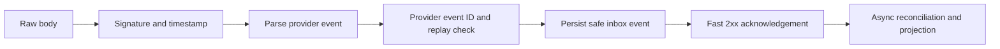

# Webhook Contract

Telnyx and ElevenLabs webhooks are distinct provider boundaries. The common lifecycle is:

Simulation never posts to a public provider webhook. It invokes internal application services after authenticated scenario validation.
