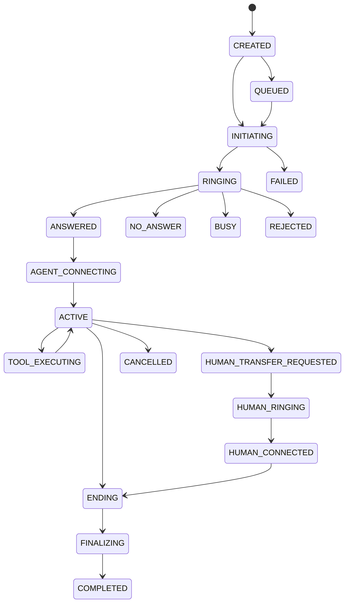

# Call state machine

The call state machine is server-authoritative and separate from the broader Conversation lifecycle. It is defined in `lib/telephony/call-state-machine/index.ts`.

Only validated provider events or internal simulation events may transition a call. Invalid/out-of-order events are stored for reconciliation rather than allowing the browser to force a state. Terminal outcomes retain a specific termination reason such as no answer, provider failure, transfer failure, compliance block, or user hangup.

In simulation mode, the simulation provider emits the same normalized event contract. Its provider identifiers are explicitly prefixed and records carry a simulation execution mode; no fake Telnyx identifier is generated.
