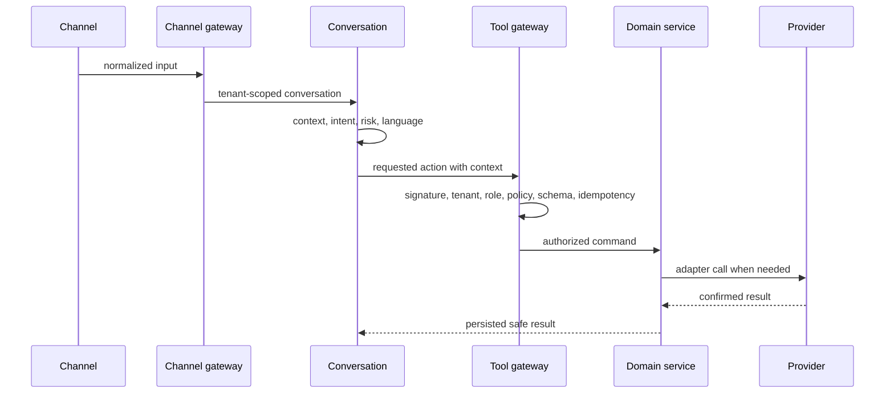

# Data Flow

Provider events use the complementary path: raw body, signature and timestamp verification, event identity, idempotent storage, fast acknowledgement, asynchronous projection, and audit correlation.
