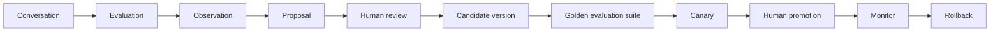

# Supervised improvement loop

VoxDesk does not allow conversation analysis to mutate production agent behavior automatically.

## Lifecycle controls

- Evaluators create observations with evidence and a bounded root-cause hypothesis.
- A proposal identifies its affected business, language, agent version, required evaluation cases, risk, and rollback plan.
- Approval creates an immutable candidate; it does not replace the production version.
- A candidate must complete required evaluation suites without critical failure before it can be canaried.
- Promotion and rollback are recorded as auditable state transitions. Rollback restores the most recent known previous deployment.

This lifecycle is suitable for gradual, human-supervised improvement. It is not evidence that every production configuration has completed a canary. See [product capabilities](../product/capabilities.md) for current capability status.
