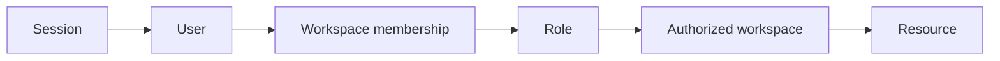

# Multitenancy

VoxDesk resolves authorization before data access. The governing chain is:

## Rules

- A client-supplied workspace, business, contact, or agent identifier is never authoritative.
- Queries and mutations are scoped to the resolved workspace. Cross-workspace resources are returned as a non-disclosing not-found/forbidden result.
- Provider events use verified routing and stored correlations to resolve tenant context; they do not trust model or browser metadata.
- Contacts, transcripts, recordings, campaigns, leases, tool execution, evaluation data, and candidate versions are workspace-scoped.
- Logging uses safe correlation IDs and avoids raw customer content by default.

Demo use is isolated from customer tenants and uses explicit signed demo identity/session mechanisms. It is not a request-header bypass.

The security suite includes tenant-isolation tests for conversations, contacts, calls, appointments, campaigns, and related operational resources. See [tenant isolation](../security/tenant-isolation.md) and the [data flow](data-flow.md).
