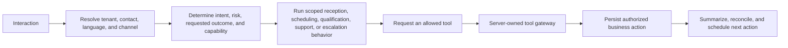

# Conversation orchestration

The orchestrator turns a normalized customer interaction into a bounded workflow. It is not a general-purpose autonomous agent.

## Scoped capabilities

The current architecture supports bounded reception, scheduling, qualification, support, callback, and escalation behavior where configured. A capability receives only the context and tools necessary for its workflow. It does not receive arbitrary tenant records or credentials.

## Shared state

`ConversationState` carries identity-verification progress, collected fields, requested outcome, appointment/qualification/handoff state, safe tool results, risk flags, and a compact summary. Transcript text remains evidence; it is not the only workflow-state store.

## Tool boundary

Every side effect follows this path:

1. The provider/model sends a tool request.
2. VoxDesk verifies the signed, short-lived conversation context.
3. The server resolves the conversation and workspace again, validates input, applies policy and idempotency, and invokes a domain service or adapter.
4. VoxDesk persists a safe tool execution result before returning a minimum response to the agent.

See [tool authorization](../security/tool-authorization.md) for the complete boundary. All loops have an iteration limit, deadline, cancellation path, terminal state, and human fallback.
