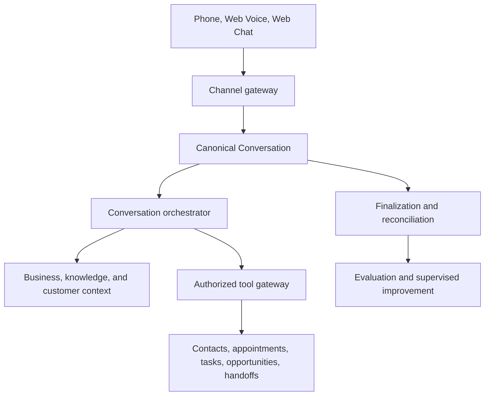

# Architecture overview

VoxDesk is a modular Next.js application with a PostgreSQL domain model. It keeps customer operations state inside VoxDesk and treats AI, carrier, CRM, and calendar providers as bounded adapters.

## Ownership boundaries

| Boundary                   | Owner                       | Responsibility                                                                                                     |
| -------------------------- | --------------------------- | ------------------------------------------------------------------------------------------------------------------ |
| Realtime conversation      | ElevenLabs                  | Speech, turns, agent execution, provider conversation history, and post-call signals when configured.              |
| PSTN and SIP               | Telnyx                      | Numbers, carrier transport, call-control events, transfer primitives, and telephony failures in live mode.         |
| Business operations        | VoxDesk                     | Tenant identity, policy, CRM state, scheduling, campaigns, compliance, tool authorization, persistence, and audit. |
| Public portfolio telephony | VoxDesk simulation provider | Deterministic normalized events that exercise the same state and domain-services path without a paid PSTN call.    |

## Invariants

- A `Conversation` is the canonical customer interaction record across phone, web voice, and web text. A `Call` is a phone-specific projection.
- The model can request a tool, but cannot independently write business data.
- Provider webhooks are verified, idempotent, and acknowledged before slow reconciliation work.
- Resource IDs do not grant access. Every protected resource is resolved inside an authorized workspace.
- Simulation and live telephony share contracts; a simulated call is visibly marked and is never represented as a Telnyx call.

See the [system context](system-context.md), [data flow](data-flow.md), [provider boundaries](provider-boundaries.md), and [telephony architecture](telephony.md).
