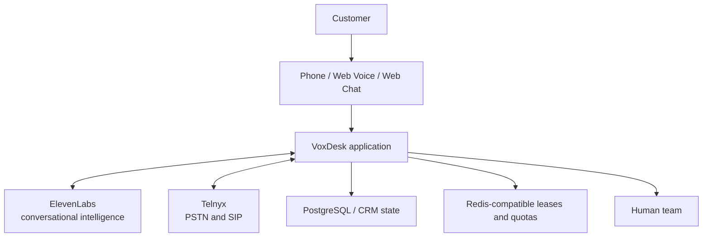

# System Context

ElevenLabs owns realtime agent interaction. Telnyx owns phone transport. VoxDesk owns tenancy, business state, policy, authorization, persistence, compliance controls, and reconciliation.
