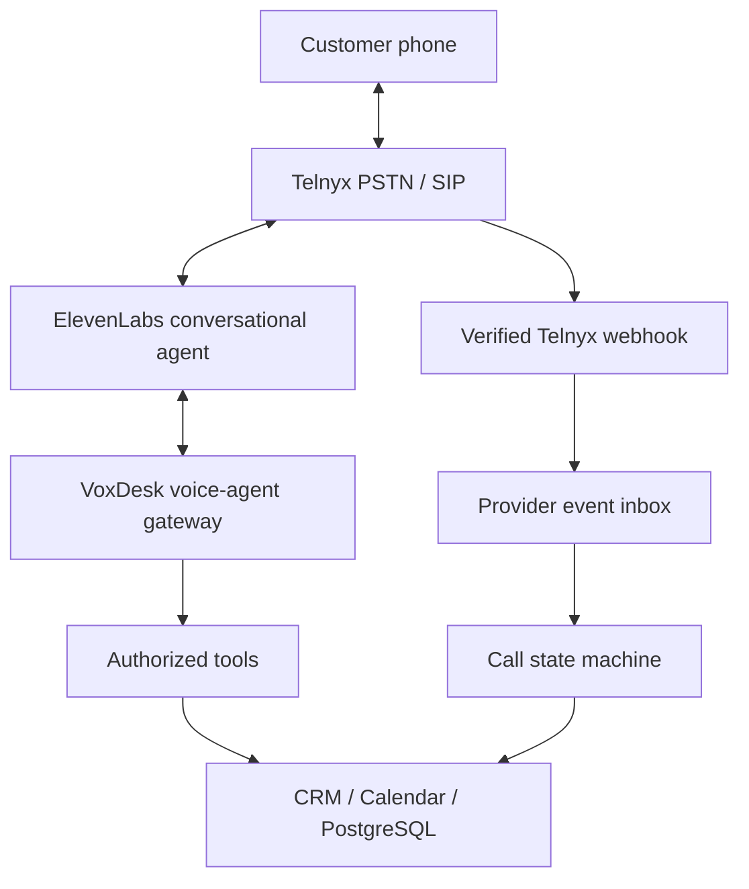
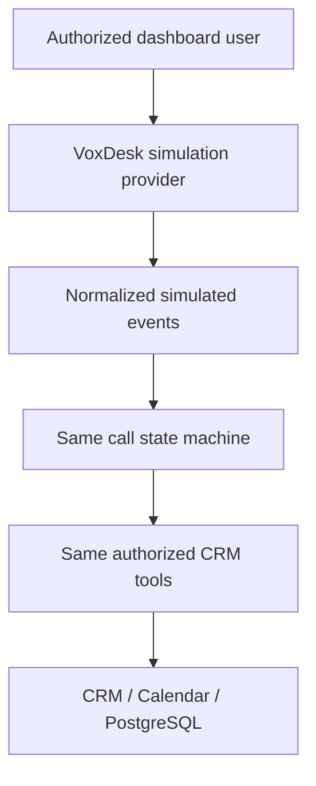
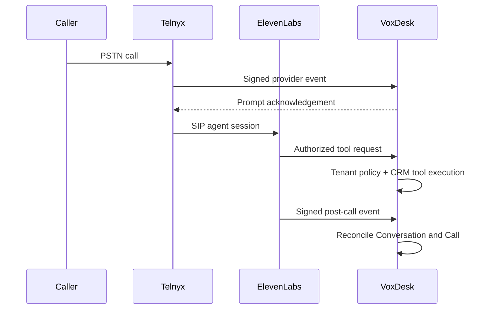
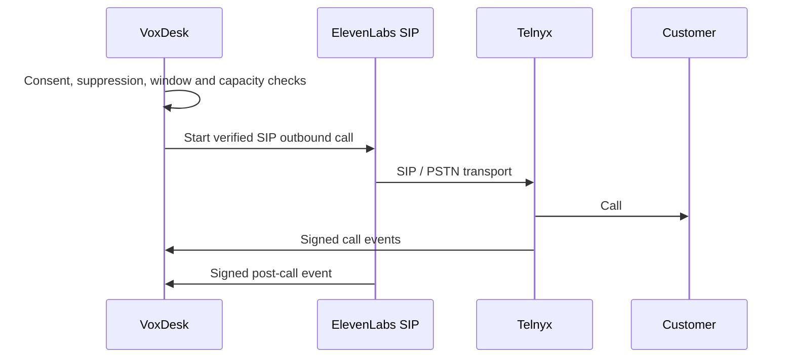
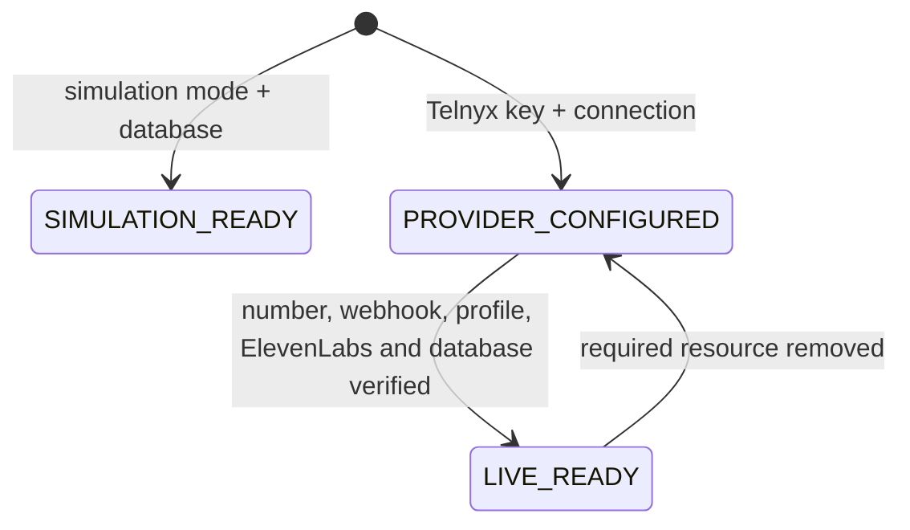
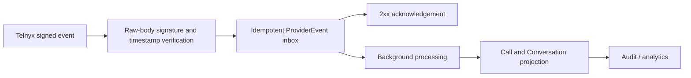
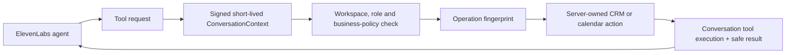

# Telephony architecture

ElevenLabs is VoxDesk's conversational intelligence layer. Telnyx is VoxDesk's
production PSTN and SIP provider. VoxDesk owns the normalized call lifecycle,
authorization, CRM persistence, campaign controls, compliance checks, and audit history.

## Production call architecture

## Portfolio simulation architecture

The simulator never calls Telnyx, ElevenLabs SIP, or the public Telnyx webhook.
Simulated records use provider `SIMULATION`, execution mode `SIMULATION`, and
clearly-prefixed `sim_…` identifiers.

## Inbound production sequence

## Outbound production sequence

## Readiness state machine

See [the client activation guide](../guides/activate-live-telephony.md) for the
live onboarding and rollback procedure.

## Provider event lifecycle

Simulation bypasses this public provider path entirely. Its events are created by
the authenticated internal simulation service and are marked `SIMULATION`.

## ElevenLabs tool authorization

