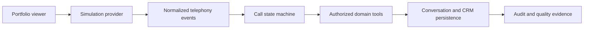

# Demo Architecture

```mermaid
flowchart LR
  Viewer[Portfolio viewer] --> Simulator[Simulation provider]
  Simulator --> Events[Normalized telephony events]
  Events --> State[Call state machine]
  State --> Tools[Authorized domain tools]
  Tools --> CRM[Conversation and CRM persistence]
  CRM --> Audit[Audit and quality evidence]
```

The simulation provider is internal and authenticated. It cannot call Telnyx and no public provider webhook accepts simulation events.
