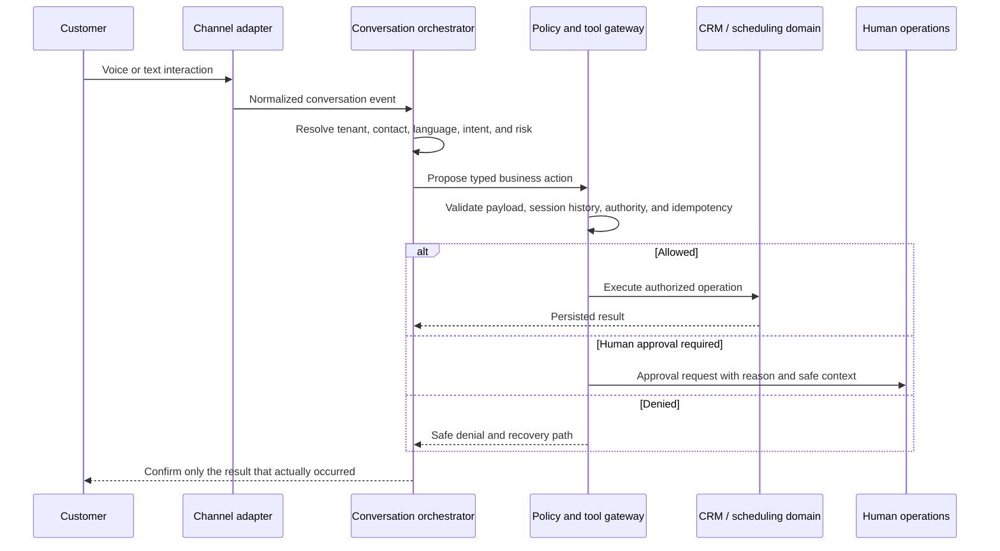
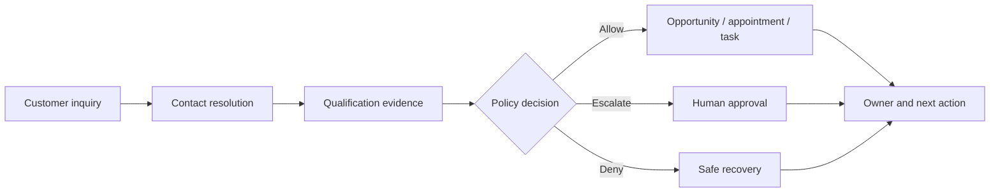
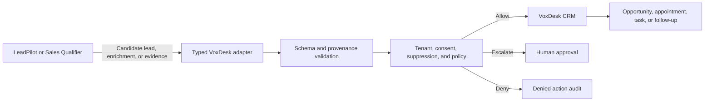
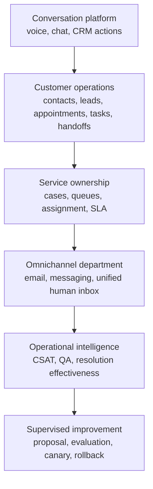

# Customer Operations Function Catalog

This catalog describes what VoxDesk is designed to do, where authority lives, and the maturity of each capability.

Status terms:

- **Implemented**: application code and persistence exist.
- **Configured**: required runtime/provider settings are present.
- **Verified**: an acceptance test has exercised the configured capability.
- **Simulated**: deterministic provider events exercise the application workflow without external carrier activity.
- **Activation required**: the adapter exists, but customer-owned external resources are required.
- **Planned**: documented direction; not presented as current functionality.

## Customer interaction lifecycle

## Function matrix

| Function                 | What it does                                                                                                                    | Authority and safety boundary                                                                                          | Current maturity                                                  |
| ------------------------ | ------------------------------------------------------------------------------------------------------------------------------- | ---------------------------------------------------------------------------------------------------------------------- | ----------------------------------------------------------------- |
| Web voice                | Starts a browser conversation with an ElevenLabs agent through a server-issued signed URL.                                      | API key remains server-side; session bootstrap requires a valid demo session; CRM persistence is checked before start. | Configuration dependent                                           |
| Web text                 | Uses the canonical conversation and business-action architecture without pretending to be a telephone call.                     | Tenant and tool policy remain server-owned.                                                                            | Implemented path; acceptance verification required per deployment |
| Telephone simulation     | Replays normalized call events through call and CRM workflows without placing a PSTN call.                                      | Cannot call the Telnyx live provider in simulation mode; records are labelled simulation.                              | Implemented / simulated                                           |
| Inbound PSTN             | Resolves a provisioned Telnyx number, provider events, ElevenLabs session, business context, and CRM state.                     | Signed webhook, exact provider identifiers, tenant routing, and live readiness are required.                           | Activation required                                               |
| Outbound PSTN            | Executes requested callbacks and approved operational workflows.                                                                | Consent, suppression, calling window, caller ID, attempts, campaign approval, and capacity checks precede dialing.     | Activation required                                               |
| Conversation state       | Stores channel, direction, provider correlation, language, intent, outcome, summary, messages, fields, tools, and completeness. | Workspace/business scope is retained throughout the lifecycle.                                                         | Implemented                                                       |
| Contact and Customer 360 | Links customer identity and operational history across conversations and actions.                                               | Cross-tenant access is denied; sensitive display values are masked where required.                                     | Implemented; timeline continues to mature                         |
| Lead qualification       | Collects qualification evidence and recommends a commercial next action.                                                        | Criteria and evidence are retained; no unsupported probability-of-close claim is generated.                            | Implemented domain path                                           |
| Opportunities            | Records qualified commercial work separately from an unqualified lead where the lifecycle requires it.                          | Creation/update occurs through authorized tools and idempotent domain services.                                        | Implemented domain path                                           |
| Appointments             | Checks availability and books, reschedules, or cancels according to configured rules.                                           | The agent confirms only after the adapter/database confirms success.                                                   | Implemented domain path; provider dependent                       |
| Tasks and follow-ups     | Creates owned work after a conversation or approved workflow.                                                                   | Draft language alone cannot send external communication; consent and channel rules still apply.                        | Implemented                                                       |
| Human handoff            | Requests warm transfer, cold transfer, callback, task, or queue handling with structured context.                               | “Connected” is only valid after provider confirmation; failed transfer offers an actual fallback.                      | Implemented state model; live transfer provider dependent         |
| Campaign controls        | Manages approval, dry run, eligibility, attempts, concurrency, pause, resume, and cancel.                                       | Arbitrary browser dialing is prohibited; recipients are evaluated individually.                                        | Implemented controls; live carrier activation required            |
| Analytics                | Aggregates real conversation and operations state.                                                                              | No fabricated counters or unsupported quality score.                                                                   | Partial                                                           |
| Quality evaluation       | Evaluates correctness, tools, workflow completeness, compliance, language, and handoff behavior.                                | Dimension results remain explainable; one opaque “AI score” is not treated as truth.                                   | Implemented lifecycle; evaluation coverage varies                 |
| Supervised improvement   | Creates observations and proposals, tests candidates, and supports canary/promotion/rollback.                                   | Production behavior is never changed directly by an evaluator or conversation model.                                   | Implemented lifecycle; deployment verification required           |
| Cases, queues, and SLA   | Extends an interaction into owned support work with priority, assignment, waiting states, and resolution targets.               | Requires tenant-scoped schema, authorization, migrations, UI, and acceptance tests.                                    | Planned                                                           |
| Email and messaging      | Normalizes additional channels into the canonical conversation model.                                                           | Must retain identity, consent, tenant, and tool controls.                                                              | Planned                                                           |

## Lead operations

VoxDesk does not treat a transcript as a lead record. A useful lead flow retains:

- identity and contact provenance;
- requested service and intent;
- configured qualification criteria;
- evidence from specific conversation turns or verified tools;
- confidence and unresolved fields;
- consent, suppression, and communication preference;
- opportunity, appointment, task, owner, and next action;
- the tool decision and idempotent execution result.

## Optional LeadPilot and Sales Qualifier adapters

LeadPilot and Sales Qualifier are **not connected in the public VoxDesk deployment**. They can become optional boundary adapters if their APIs and data contracts are available.

A safe adapter can provide:

- candidate contacts from an approved source;
- enrichment with field-level provenance;
- qualification evidence or a specialist recommendation;
- campaign segment suggestions;
- outcome synchronization.

It must not:

- bypass VoxDesk tenant authorization;
- dial or message a person directly;
- overwrite verified customer data without policy;
- ignore consent, suppression, calling windows, or attempt limits;
- create duplicate contacts or opportunities on retry;
- be labelled connected until connectivity and end-to-end behavior are verified.

## Customer-service department evolution

The evolution is capability-based rather than a claim that all roadmap modules are already active.
