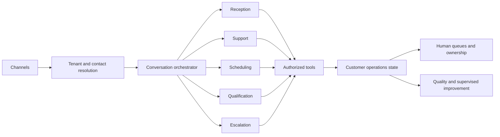

# From Conversation Platform to Customer-Service Department

VoxDesk's next stage is a controlled customer-operations department:

1. **Omnichannel intake** normalizes phone, web voice, web chat, and future email/form/API events.
2. **Unified identity** links channels to one tenant-scoped contact instead of creating per-channel customer records.
3. **Conversation orchestration** classifies intent, priority, risk, language, and requested outcome.
4. **Bounded capabilities** handle reception, support, qualification, scheduling, follow-up, and escalation with only the tools each workflow needs.
5. **Operations state** records contact history, cases, appointments, opportunities, tasks, commitments, and handoffs.
6. **Human operations** owns queues, exceptions, and risky decisions; the agent provides context rather than a claim of completed transfer.
7. **Quality and improvement** creates observations and proposals that require human approval and regression evaluation.

The Case/Ticket domain is planned rather than added prematurely. When implemented it should be workspace and business scoped, link contact and conversation, use explicit priority/status/queue/SLA fields, and arrive with migrations, authorization, Customer 360 UI, and acceptance tests.
