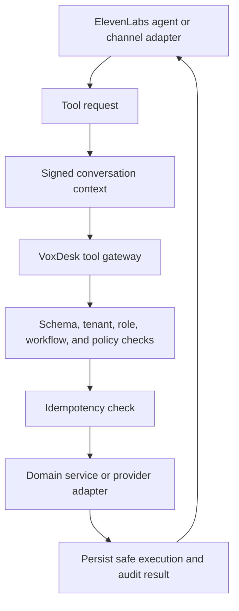

# Tool authorization

The model cannot directly write to the CRM, calendar, or operational records.

The signed, short-lived `ConversationContext` includes conversation, workspace, business, optional contact, agent/version, training-pack version, channel, direction, language, issue time, and expiry. VoxDesk resolves the conversation and tenant a second time before action.

Every tool request is schema-validated. Side-effecting tools require an execution ID and operation fingerprint so a provider retry returns the original result instead of creating duplicates. The result stored for the agent is safe and minimal; credentials and unrestricted customer data are never returned.

Browser or model values never establish workspace, business, contact, agent, or authority. Forged, expired, cross-tenant, or policy-blocked requests are rejected and tested as security cases.
