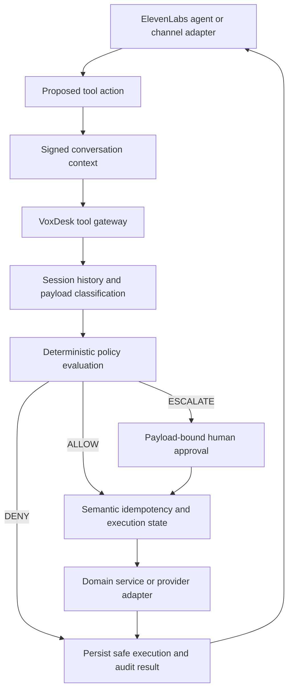

# Tool authorization

The model cannot directly write to the CRM, calendar, or operational records.

## Authorization and execution integrity

These are separate controls:

- **Policy authorization** answers whether an action is allowed, denied, or requires human approval.
- **Execution integrity** answers whether the same semantic action has already run and whether it is safe to retry.

The signed, short-lived `ConversationContext` includes conversation, workspace, business, optional contact, agent/version, training-pack version, channel, direction, language, issue time, and expiry. VoxDesk resolves the conversation and tenant a second time before action.

Every tool request is schema-validated. Consequential tools receive an action ID and a canonical payload fingerprint. The database stores execution state under unique conversation/action and conversation/fingerprint constraints so an exact provider retry returns the original successful result instead of creating a duplicate.

## Session-aware policy

The canonical `conversationId` is the policy session ID across bounded specialists. Policy evaluation considers:

- identity-verification state
- risk and compliance flags
- current specialist
- recent allowed, blocked, and completed actions
- data categories previously accessed
- sensitive fields in the proposed payload
- external communication or mutation risk

This allows a sequence such as accessing customer contact data followed by an external follow-up request to be escalated even when either call appears routine in isolation.

## Human approval

An `ESCALATE` decision creates a short-lived `ToolApprovalRequest`. The approval contains no raw payload; it is bound to the action, conversation, tenant, agent evidence, policy version, and SHA-256 payload fingerprint. Only workspace owners and administrators with `tools:approve` may decide it.

Approval does not execute the tool. The agent or workflow must retry with the approval request ID and the identical payload. VoxDesk rechecks expiry, status, tenant, and fingerprint, executes once, then marks the approval consumed. A changed payload requires a new policy decision.

## Audit evidence

Policy and approval records include safe reason codes, fired rule IDs, risk tier, risk score, policy version, agent, specialist, session, action ID, payload fingerprint, approver, and correlation ID. Credentials, full transcripts, and raw sensitive values are excluded.

Browser or model values never establish workspace, business, contact, agent, or authority. Forged, expired, cross-tenant, payload-mismatched, suppressed, or policy-blocked requests are rejected and covered by security tests.

The deterministic VoxDesk evaluator is the enforcement authority. A future external policy provider may implement the same interface, but it cannot override tenant isolation, consent, suppression, idempotency, or database integrity.
