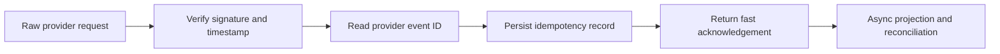

# Webhook security

Real provider webhooks are not a simulation entry point. Simulation enters internal services through an authorized, validated path.

## Telnyx voice

`/api/webhooks/telnyx/voice` verifies the configured Telnyx public key/signature and timestamp freshness, normalizes the provider event, and applies provider-event idempotency. It preserves safe payload metadata and defers slow CRM, analytics, and reconciliation work.

## ElevenLabs post-call

The post-call route verifies its raw-body HMAC and timestamp before a provider event can finalize a conversation. ElevenLabs post-call data is reconciled with VoxDesk tool state and Telnyx carrier events; it is not trusted as proof that a server-side tool mutation succeeded.

## Failure behavior

Invalid signatures, stale timestamps, malformed events, and replayed events are rejected. Provider events can arrive duplicated or out of order, so processing is idempotent and reconciliation uses correlation identifiers and transition rules. Safe logs include correlation/provider-event identifiers, not provider credentials or full customer payloads.
